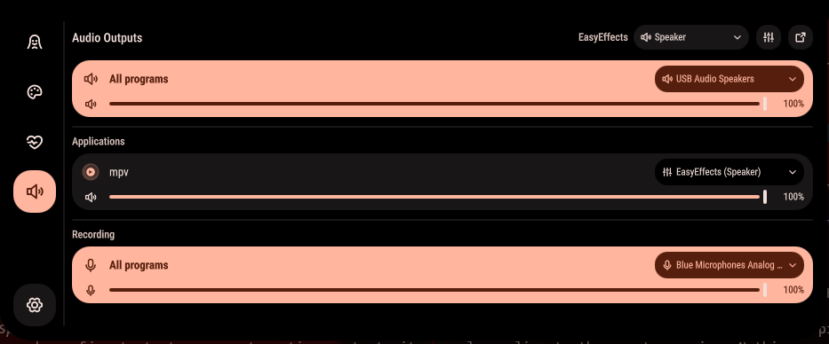
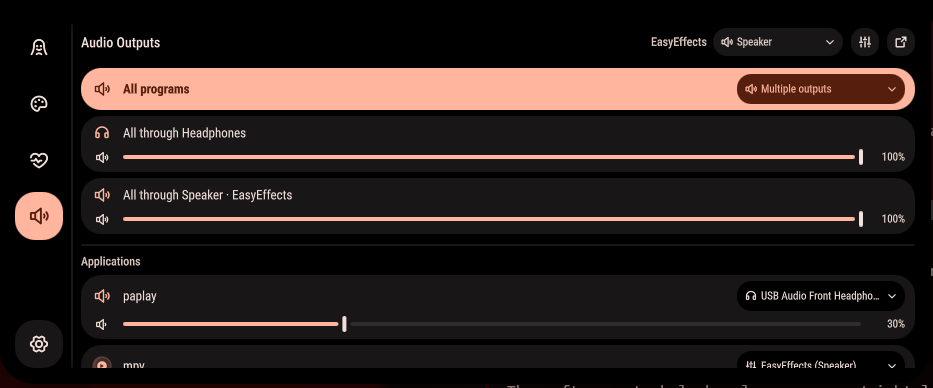

# Audio routing

Per-application audio routing in the Ambxst notch. A fourth dashboard tab,
under the vitals: every program that is playing audio, which output it is
going to, a slider and a mute for each, and a dropdown to move it somewhere
else, including into EasyEffects. Same again for microphones.



| Row | Dropdown | Slider |
|---|---|---|
| **All programs** | Moves every stream at once and sets the default output, so new programs follow. | System volume: the hardware device the default route ends at. |
| **One program** | Moves just that stream. | That program's own volume. |
| **All programs** *(Recording)* | Default microphone, and moves every recording stream to it. | Microphone gain. |
| **One program** *(Recording)* | Which microphone that program records from. | That stream's gain. |

Click the speaker or microphone glyph on any row to mute it. Rows carry the
program's desktop icon, recoloured to your theme the way the dock and
launcher do it. The titlebar has an **EasyEffects** picker for the device
EasyEffects outputs to, plus buttons to open EasyEffects and pavucontrol.

When programs are split across devices, "All programs" no longer has a single
answer, so it says so and one row per device appears underneath with that
device's volume as the knob.



`ambxst run audio` (or `dashboard-audio`) opens the tab directly, for a keybind.

## Install

```
https://github.com/drpezzer/ambxst-mods/tree/main/packages/audio-routing
```

Paste that into **Settings → Mods**, or:

```bash
ambxst mods install https://github.com/drpezzer/ambxst-mods/tree/main/packages/audio-routing
ambxst mods enable drpezzer.audio-routing
ambxst reload
```

Needs `pactl` (pipewire-pulse), which Ambxst's own install brings in along
with EasyEffects and pavucontrol. Nothing else.

## EasyEffects: one setting to change

EasyEffects ships with **Process all output streams** on. In that mode it
pulls every stream into its own sink and yanks it back half a second after any
move, so per-app routing silently does nothing. EasyEffects is a mixing bus,
not a router: everything it captures sums into one buffer feeding one device,
so it can never split programs across devices.

Turn that setting off in EasyEffects → Preferences, then pick the device
EasyEffects should feed from the tab's titlebar picker (it pins EasyEffects to
it and restarts EasyEffects for you, since EasyEffects only reads its config at
startup). The tab shows a notice whenever it detects EasyEffects capturing
again. Programs you want processed are routed *into* EasyEffects from their
row; everything else goes straight to a device.

Volume for anything routed through EasyEffects lives on the device EasyEffects
feeds; the `easyeffects_sink` knob itself is a no-op, because EasyEffects
captures the sink's monitor, which PipeWire taps before volume.

## What it changes

- New: `modules/services/AudioRouting.qml`, the three files under
  `modules/widgets/dashboard/audio/`, `scripts/easyeffects_output.py`.
- `modules/widgets/dashboard/Dashboard.qml` — registers the tab.
- `modules/services/GlobalShortcuts.qml` — the `audio` / `dashboard-audio` commands.
- `nix/packages/media.nix` — `pulseaudio` for `pactl` on Nix.

Works with Ambxst `>=1.3.0`. No new config keys.
