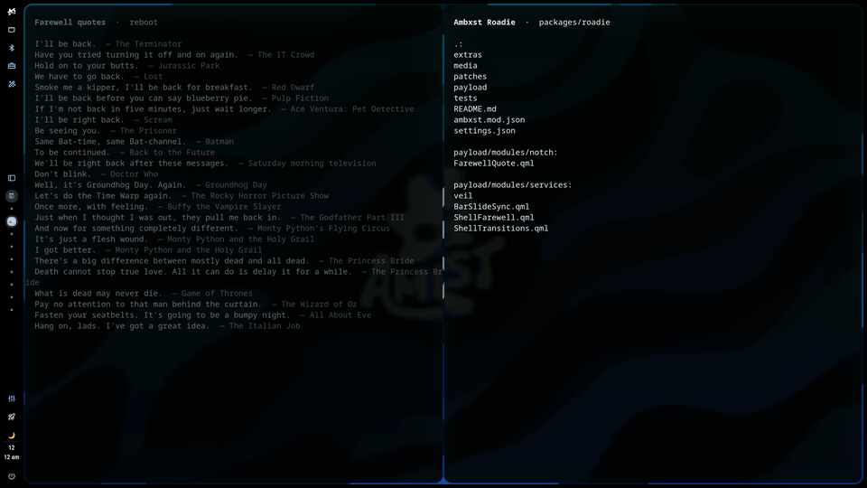
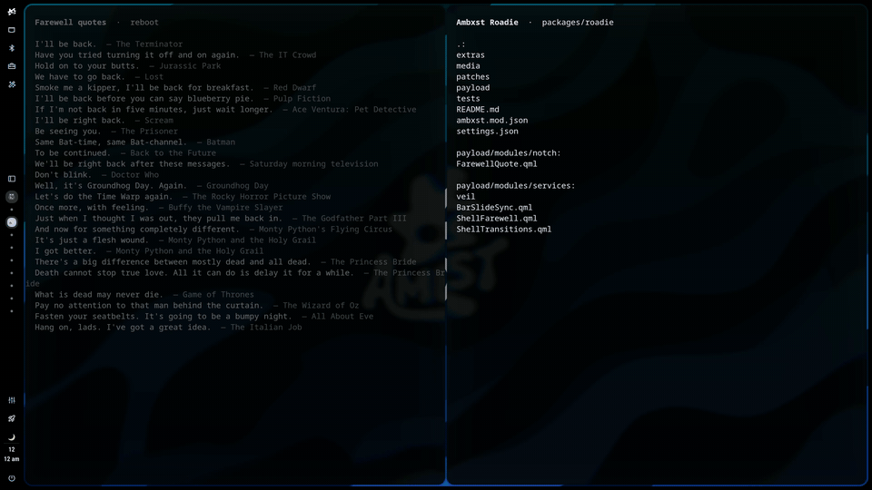
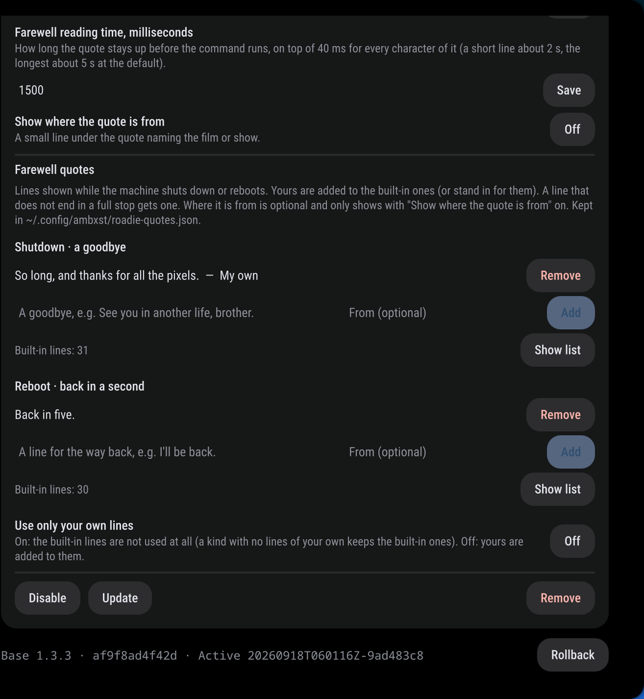
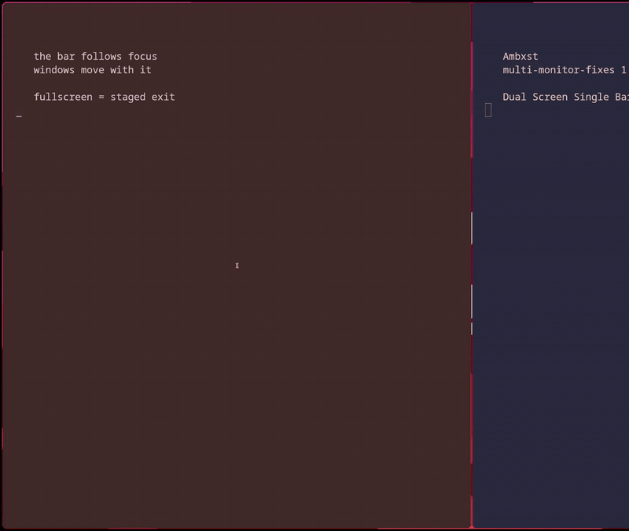
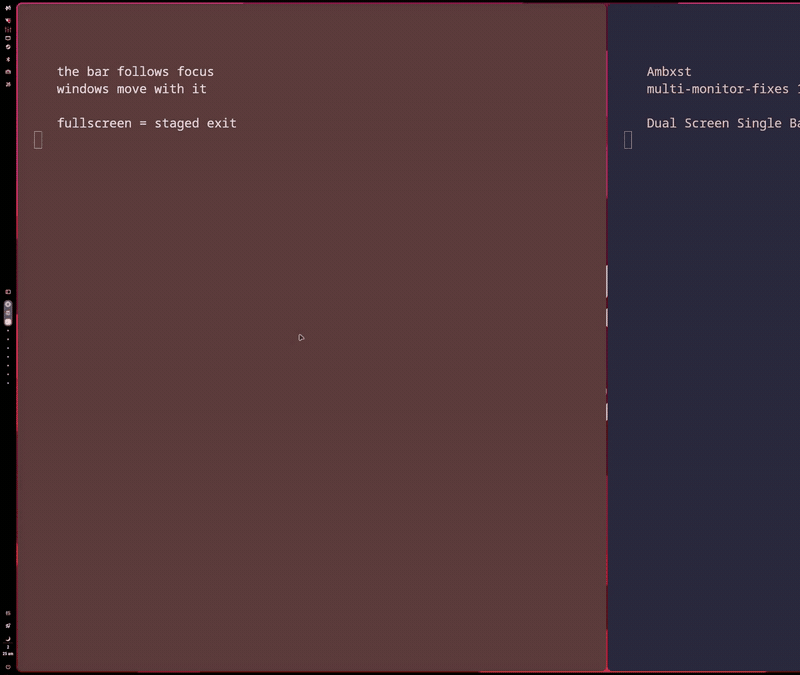
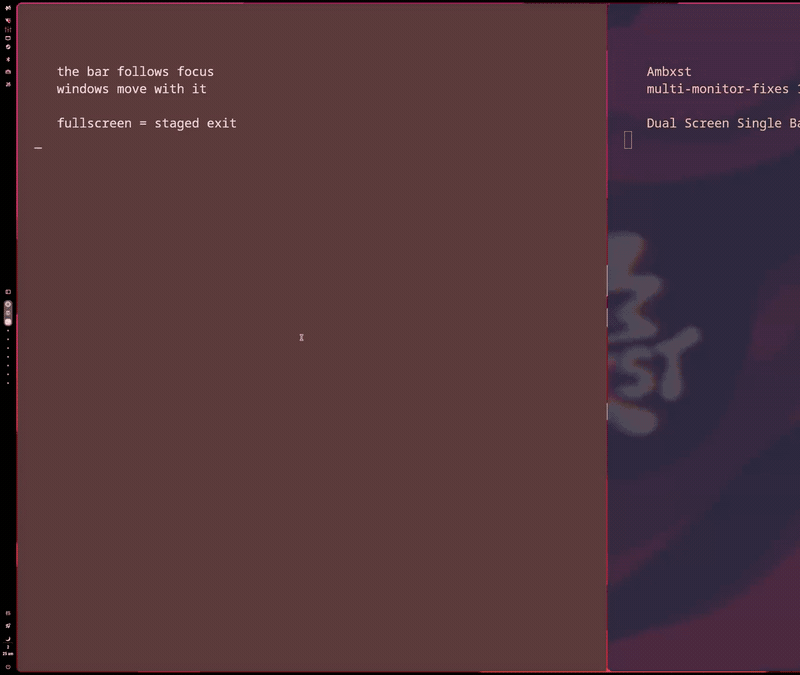
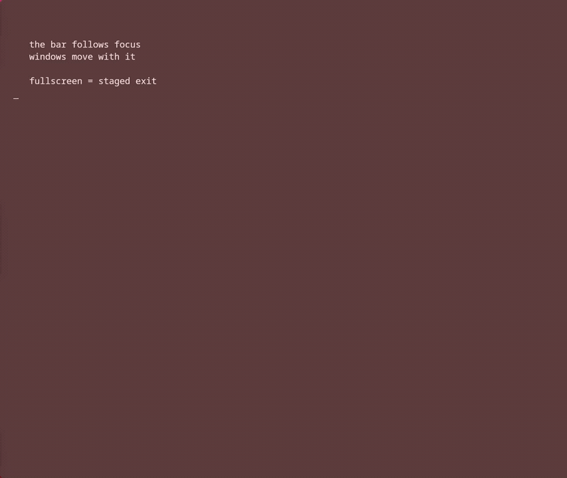

# Ambxst Roadie

The crew that keeps the show running while the stage changes: the shell
starting and reloading, monitors coming and going, focus moving between
screens, a game going fullscreen. Every one of those is a staged movement
with the windows in step, instead of a snap, a blink or a stranded panel.

Roadie replaces **Ambxst Clean Load** and **Multi-monitor fixes**: it is both
of them in one package, plus a boot sequence and a farewell. It patches the
same files, so it cannot be enabled together with either (the manifest declares
the conflict) -- disable those two first.

| Shutting down | Booting |
|---|---|
|  |  |

## Shell start and reload



Gives Ambxst a fluid way in and out.

Stock Ambxst assembles itself in pieces: the wallpaper pops in whenever its
image has decoded, the frame and bar appear a beat later, and the closed AI
sidebar sweeps across the screen once on the way. `ambxst reload` is worse:
Quickshell is killed outright, so wallpaper, frame and bar vanish in one frame
and the compositor backdrop shows until the new shell has loaded a second or
two later.

With Roadie a reload is one staged movement:

1. **Out** (about 1.4 s). The bar, notch and dock ease out past the screen
   edges first; the frame follows them out a beat later and the windows expand
   into the space; the wallpaper is the slowest, still fading to the theme
   background colour after the rest has gone. Nothing snaps.
2. The shell restarts on a quiet, plain background.
3. **In** (about 0.95 s). The wallpaper starts fading up first; the frame
   closes in from the edges with its rounding while the windows shrink back
   to make room; the bar, notch and dock arrive last, decelerating into place.

A boot has its own sequence, with the lock in the middle of it: see [Booting](#booting).

| leave (L = 900 ms)          | enter (E = 650 ms)          |
|-----------------------------|-----------------------------|
| chrome  0 .. 0.85 L, in-out-cubic | curtain 0 .. 1.4 E, out-cubic |
| frame   0.2 L .. 1.2 L, in-out-cubic | frame 0.2 E .. 1.2 E, out-cubic |
| curtain 0.1 L .. 1.5 L, in-out-sine | chrome 0.45 E .. 1.45 E, out-cubic |

### How it works

**Entering.** A singleton (`ShellTransitions`) drives three staged channels
(`progress` for the frame, `chromeProgress` for bar, notch and dock, `curtain`
for the wallpaper sheet) once the bar and theme config are loaded, the
compositor's monitor and window state has arrived, and the first wallpaper
image has decoded. The frame's thickness and inner radius scale by the first,
the bar, notch and dock offsets by the second, a sheet in the theme background
colour sits over the wallpaper at the third's opacity, and the reservation
windows only reserve space while the frame is in place, which is what makes
the compositor's windows follow. Waiting for the compositor state matters:
until it arrives the notch and dock believe the workspace is empty and reveal
themselves, only to hide again a moment later.

**Leaving.** Quickshell exits about ten milliseconds after the `SIGTERM`
that `ambxst reload` sends, without running any QML teardown, so the shell
cannot animate out once the reload has been issued. It has to leave first.
Three entry points do that:

- `ambxst run reload` (also usable as a keybind command) leaves, then issues
  `ambxst reload` itself when the animation is done.
- `qs ipc --pid $(cat $XDG_RUNTIME_DIR/ambxst-qs.pid) call roadie reload`
  does the same over IPC; `... call roadie leave` only plays the
  animation and returns how many milliseconds it takes.
- **The `ambxst` wrapper in `extras/`** makes a plain `ambxst reload` typed
  anywhere (terminal, the stock keybind, the launcher action, the Mods panel's
  "Restart now") do the same. Install it earlier in `PATH` than the real
  binary:

      cp extras/ambxst-wrapper ~/.local/bin/ambxst && chmod +x ~/.local/bin/ambxst

  Every other subcommand passes straight through. If the shell is not running
  or does not answer within a second, the real reload runs at once.

  Shells that were already open when you installed the wrapper still have the
  real binary cached: run `hash -r` in them (or open a new terminal), or a
  plain `ambxst reload` there is a cold kill and the windows snap instead of
  following the frame.

**The veil.** For a cold kill without the wrapper (a plain `ambxst reload`,
the watchdog, a crash), a tiny detached Quickshell helper (`veil/Veil.qml`)
that the shell keeps connected over a local socket maps the last wallpaper and
frame the instant the shell's socket closes, plays the leave animation itself
(frame collapses into the edge, wallpaper fades to the background colour), and
holds that until the new shell reports its wallpaper is up. It is idle and
windowless while the shell runs, imports nothing from the shell, and exits
after each reload; the new shell spawns a fresh one.

**Windows move with the frame.** The compositor moves the windows into and
out of the frame's space with its own resize animation, which on Hyprland is
`windowsMove` (250 ms by default), so they used to snap ahead of the frame.
For the duration of a transition the mod retunes `windowsMove` to the frame
channel's duration and easing over `hyprctl eval`, then restores what was
there (the effective value, walking up to `windows` or the global default if
`windowsMove` itself was not set). The original is also written to
`$XDG_STATE_HOME/ambxst/roadie-windowsmove.json` for the duration,
so a shell killed mid-transition still gets it restored by the next one.
Hyprland only; other compositors are left alone.

**Corner windows.** Stock Ambxst creates its screen-corner windows before the
theme file has loaded, so they flash as bare boxes at every screen corner for
a moment; they now wait for the theme and only exist while the frame is in
place.

**Volume and brightness pop-ups.** The on-screen display shows whenever the
audio or brightness service reports a change, and both also report while
reading their initial state after a start: the PipeWire sink and source sync
within the first second or so, and every monitor reports the moment its first
brightness read lands, which over DDC can be ten seconds after the shell came
up. So the pop-up plays over the entry, or long after it, on every reload. By
default the mod swallows exactly those reports: volume and microphone while
the start window is open (the entry plus 1.5 s), brightness when the report is
the one that turned its monitor ready (which also covers the re-read after a
wake or a monitor hotplug). A real key press or slider change still shows it.
The display can also be turned off altogether.

**Sidebar fix.** The AI assistant sidebar's slide was a `Behavior` on its
`x`, and `x` depends on the panel width, so the first layout (panel width 0 to
screen width) and the config-driven width change both played the slide with
the sidebar visible. It now animates only when it is actually opened or closed.

## Booting


The first shell start of a session is a boot (every later one is a reload; a
marker in the session's runtime dir tells them apart). At boot:

1. The screen stays in the theme background colour, on every monitor, from
   the shell's first frame until the shell is ready.
2. The wallpaper fades in and the frame comes in -- as a
   plain gutter, with no bar in it: the bar is held away (as on an unfocused
   screen), and the notch and dock stay off screen if a lock is coming.
3. The shell **locks** with the Ambxst lockscreen. **Lock after boot** decides:
   *Auto* (default) locks unless you logged in through a greeter -- SDDM, GDM,
   LightDM, greetd, ly and friends, read from the PAM service name logind keeps
   for the session, so an *autologin* through one of them still locks -- or an
   external locker such as hyprlock is already running; *Always* and *Never*
   skip the detection.
4. When you unlock, the bar slides in with the windows making room, the way
   it arrives when focus reaches a screen, and the notch and dock enter as
   they do after a reload.

What is on screen *before* the shell's first frame is the compositor's: on
Hyprland set `misc { disable_hyprland_logo = true, force_default_wallpaper = 0,
background_color = 0x000000 }` (or the theme background) so the boot is plain
until the shell is up.

`qs ipc --pid $(cat $XDG_RUNTIME_DIR/ambxst-qs.pid) call roadie bootPreview`
forgets that the session has started and reloads, so the next start plays the
boot sequence, lock included; `bootState` prints what was detected.

## Shutting down and rebooting

| Power Off: a goodbye | Reboot: back in a second |
|---|---|
|  |  |

**Reboot** and **Power Off** in the notch's power menu say goodbye first:

1. The menu's buttons dissolve and the notch swells until it is the whole
   screen, on every monitor in step (900 ms, ease-in-out). The bar's pills and
   the dock fade to black over the first 70% of that, so the notch's edge never
   wipes them out.
2. A line from a film or show fades in at the centre of the screen the menu
   was used on: a goodbye for a shutdown ("See you in another life, brother."),
   a back-in-a-second for a reboot ("Hold on to your butts."). Every line ends
   in a full stop. None repeats until all of its kind have been shown. The
   quote is always ONE line: it is set at 2.6% of the screen's height and, where
   that would not fit in 86% of the width (an upright screen, a wide font, a
   very long line of your own), at the largest size that does.
3. It stays up long enough to read -- 1.5 s plus 40 ms per character -- and
   only then does the command run. The quote stays until the session is gone.

**Escape** backs out at any point before the command runs and plays it all in
reverse. A click, Return or Space ends the reading pause once the quote is fully
up. If the command fails, or the machine is somehow still up 20 s later, the
farewell backs out on its own.

### Add your own quotes



Open **Settings > Mods**, select **Ambxst Roadie**, and under its settings you
will find **Farewell quotes**: type a line (and, if you like, where it is from),
press Add. Your lines are listed there with a Remove button, each built-in line
can be hidden and shown again from **Show list**, and **Use only your own
lines** drops the built-in ones altogether. Everything applies at once, no
reload.

It all lives in `~/.config/ambxst/roadie-quotes.json`, which you can also edit
by hand (there is a copy to start from in `extras/roadie-quotes.example.json`).
The file is watched, so a change is picked up without a reload:

```json
{
  "shutdown": [{ "text": "So long, partner.", "source": "Toy Story 3" }, "A plain string works too."],
  "reboot": [],
  "hidden": ["I'm finished."],
  "replace": false
}
```

They are added to the built-in lists (31 goodbyes, 30 back-in-a-seconds), or
stand in for them with `"replace": true`. An entry is either a plain string or
`{ "text": ..., "source": ... }`; the source only shows with **Show where the
quote is from** on. `hidden` lists built-in lines to leave out. Any length
works -- a long line is simply set smaller, and a line without a full stop at
the end gets one.

Over IPC (`qs ipc --pid $(cat $XDG_RUNTIME_DIR/ambxst-qs.pid) call roadie ...`):
`shutdown` and `reboot` do what the buttons do; `farewellPreview shutdown|reboot`
plays the whole thing and backs out without running anything; `farewellCancel`
is the Escape key; `farewellState` is for diagnostics. The quotes file has the
same commands the editor uses: `farewellQuotes`, `farewellAdd shutdown|reboot
"<line>" "<from>"`, `farewellRemove shutdown|reboot <index>`, `farewellHide
"<built-in line>" true|false`.

How it is wired: the stock `ActionGrid` runs a button's `command` itself, right
after it signals the power menu, so an early return in the menu's handler stops
nothing. While the farewell is on, the two buttons carry no `command` at all;
what they run travels as `powerCommand`, which only `ShellFarewell` executes.

## Monitors, focus and fullscreen

| Focus arrives: the bar slides in, the windows make room | Focus leaves: the bar slides out, the windows take the space |
|---|---|
|  |  |

| A window goes fullscreen: the game lands, the bar slides out, the corners straighten, the gutter settles | Fullscreen ends: the frame returns as one motion, then the bar, with the windows |
|---|---|
|  |  |

Left edge of a 4K screen, real time. The whole sequence: [demo.mp4](media/demo.mp4) (22 s, 1080p60).

- **Unplugging a monitor no longer breaks a surviving one.** When an output
  goes away, Quickshell reassigns the dying panel window's `screen` to a
  surviving output, so a panel that unregistered itself by `screen.name` at
  teardown was deleting a *live* screen's entry from the visibility registry
  and leaving the dead one behind. The survivor then had no bar, dock or
  notch panel to resolve its reveal and pinned state from, which is the
  "windows spill under the bar until reload" symptom. Panels now latch the
  name they registered under at creation and unregister by that, and the
  registry ignores an unregister that doesn't come from the registered owner.
- **The wallpaper manager survives losing its screen.** One Wallpaper instance
  owns scanning, matugen and thumbnails for the whole shell. If its monitor was
  unplugged that role died with it and every other screen kept a wallpaper it
  could no longer rescan or re-theme. The role is now handed to a surviving
  instance, carrying the current state across so nothing blanks.
- **No more invisible view stuck in the notch.** Moving an open module to the
  newly focused monitor could set and clear a screen's flag inside one event
  loop turn, leaving a deferred push behind that parked a hidden 900 px view
  in the notch. The push re-checks the flag and the close unwinds the stack.
- **Fullscreen games on a special workspace are detected.** The panel only
  caught them through a fast path gated on the focused monitor, so the shell
  came back over the game whenever focus moved. The output's open special
  workspace is now read from Hyprland and matched in the window scan as well
  as its active workspace, so the detection no longer depends on focus. On
  Hyprland the scan also reads the compositor's own per-window records
  (`Hyprland.toplevels`, primed once and refreshed on the `fullscreen`
  event): axctl enriches a new window's geometry and fullscreen state a few
  seconds after it appears, and not at all for windows created after a
  monitor hotplug, so a game that went fullscreen straight after launch was
  missed until then. That
  fast path is gone altogether: it ANDed the focused toplevel (Wayland) with
  the focused monitor (axctl), two sources that update independently, so on
  every swap away from a fullscreen window the *other* screen briefly believed
  it had one -- its bar pulled out and back and its frame blinked away.
- **No dead strip where a hidden bar used to be.** Going fullscreen hides the
  bar, the dock and the frame, but their layer-shell exclusive zones stayed
  put, so every window below kept a gap against that screen edge. The
  reservation now follows the chrome, screen for screen.
- **The bar stays away from the screen the fullscreen window is on.** The bar
  and dock read fullscreen off the *focused* toplevel, so both came straight
  back the moment focus moved to another monitor -- over a game that was still
  fullscreen, and dragging that screen's windows back off the edge with them.
  Each screen's own fullscreen state is now ORed in, the same per-output check
  the notch and frame already use, so the screen holding the fullscreen window
  keeps its chrome away until that window is gone while the other screens get
  theirs back on the next focus change. On that screen the pointer does not
  bring them back either: sweeping the cursor off the game towards the next
  monitor crosses the bar's edge, which flashed it up over the game for the
  hide delay. `bar.availableOnFullscreen` keeps its meaning on the screens
  that are only hiding in sympathy, and a notch the user deliberately opens
  still reveals the bar. On that screen the exit is staged rather than
  instant -- see "What the fullscreen slide assumes" below.
- **The windows move with the bar.** When the bar slides away for a
  fullscreen window its exclusive zone is released and the compositor moves
  the windows into the space with its own resize animation -- on Hyprland
  `windowsMove`, which Ambxst sets to 250 ms, so the windows arrived first and
  the bar trailed in. For the length of a slide `windowsMove` is retuned to
  near-instant, and the exclusive zone is walked frame by frame along the
  bar's own slide instead of being switched, so the compositor lays the
  windows out against a value that moves with the pills and the frame slab
  -- one number, committed in the same frame, rather than two animations
  started a frame apart -- then restored once things are quiet. The restore
  re-reads Hyprland first and only writes the originals back if `windowsMove`
  still carries this mod's curve; the originals are also kept on disk so a
  shell killed mid-slide is put right by the next one. Hyprland only.
- **Hiding or showing the special workspace is followed instantly.** The
  screen's open special workspace is tracked from Hyprland's own
  `activespecial` event rather than read back from Quickshell's monitor
  object, which does not refresh on that event and whose refresh, when
  requested, could be folded into one already in flight with a stale reply.
  Before, the bar sometimes stayed away from a screen showing ordinary
  windows again, or the frame and bar stayed over a game that had just come
  back.
- **Dual Screen Single Bar.** A pinned bar shows on the focused screen only
  and slides across when focus moves -- out here, in there, on the same
  slide, its space walked with it so the windows on both screens move in
  step. This makes the old "hide in sympathy with a fullscreen window
  elsewhere" rule redundant: an unfocused screen has no bar anyway, and the
  focused screen only hides for a fullscreen window it holds itself. A switch
  in **Settings > Theme > General** (and the mod's own settings page,
  `followFocus`) turns it off; off restores a bar on every screen with the
  sympathy hide.
- **An auto-hide (unpinned) bar gets the same slide.** Reveal and hide are
  the deliberate slide -- pills and frame slab together, no cross-fade --
  and the bar's space comes and goes with it, so the windows shrink as it
  arrives and grow back as it leaves, in lockstep.
- **Null guards** on about fifteen `screen.name` bindings that threw a
  `TypeError` cascade during teardown.

### What it changes

One patch, fifteen files: `Bar.qml`, `BarContent.qml`, `DockContent.qml`,
`ScreenFrameContent.qml`, `NotchContent.qml`, `NotchWindow.qml`,
`Visibilities.qml`, `GlobalStates.qml`, `UnifiedShellPanel.qml`,
`Wallpaper.qml`, `OverviewPopup.qml`, `PresetsPopup.qml`, `ThemePanel.qml`
(the Dual Screen Single Bar switch), `SettingsIndex.qml` (its search entry),
`shell.qml`; plus one new file, `modules/services/BarSlideSync.qml`, the
singleton that holds Hyprland's `windowsMove` during a bar slide and carries
the mod's settings. One mod setting, `followFocus` (settings.json); no new
config keys. Reads
Hyprland monitor state through `Quickshell.Hyprland` for the
special-workspace check; on Hyprland runs `hyprctl eval` for the window
sync and keeps the original animation in
`~/.local/state/ambxst/roadie-barslide-windowsmove.json` while tuned.

Testing hotplug without real hardware: `hyprctl output create headless` and
`hyprctl output remove HEADLESS-N` are faithful add/remove events.

#### What the fullscreen slide assumes, and what it does not

- **Bar position** -- left, right, top or bottom; the slide travels along the
  bar's own axis by the exact size the exclusive zone changes by, which is
  computed from the bar's own target size, outer margin and frame allowance.
- **Screen size and scale** -- everything is in logical pixels on both sides
  (Quickshell and the compositor's reserved area), so HiDPI and mixed-scale
  setups need nothing special.
- **`theme.animDuration`** -- the slide is `1.6 x animDuration`; at `0` every
  animation is disabled and the shell behaves exactly as before.
- **An unpinned (auto-hide) bar** rides the same slide for every reveal and
  hide, and takes its space with it; the auto-hide delay and hover rules are
  untouched.
- **Which screen has the bar** -- with Dual Screen Single Bar on (default),
  the focused one; the focused monitor comes from Ambxst's compositor
  abstraction, so this is not Hyprland-specific, and an unknown focus at
  start never hides every bar.
- **The screen the fullscreen window covers** leaves and returns in stages,
  the way the shell's own enter and leave do: the window's own arrival animation is
  allowed to finish, the bar slides out with the frame's slab following it
  back to the plain gutter (the wrap around the bar keeps its thickness, so
  its edge never shows), then the corners straighten and the gutter settles
  onto the screen edge. When the window goes, the frame returns as one motion
  and the bar slides in after it, synced with the windows.
- **Compositor** -- the window-move sync (`BarSlideSync`) is Hyprland-only,
  and speaks both of Hyprland's config dialects (`hyprctl keyword` for stock
  builds, `hyprctl eval` for Lua configs; each change is issued in both, the
  one the parser does not take fails harmlessly). On Niri or Mango it is
  inert and the slide still runs, with the compositor's own window animation.
  A `hyprctl` that hangs or is missing is given 250 ms, then the slide goes
  ahead without it.
- **One screen, or a bar on some screens only** -- with a single monitor the
  bar is simply always the focused one. If `bar.screenList` excludes the
  screen that has focus, no screen shows a bar until focus moves to one that
  has it; turn Dual Screen Single Bar off if that is not what you want.
- **Other mods** -- the retune is put back only if `windowsMove` still carries
  the bar slide's own curve, so a transition something else has taken over (the
  shell enter/leave, for instance) is never yanked; the original is kept on
  disk so a shell killed mid-slide is restored by the next start.

Works with Ambxst `>=1.3.0`.

## Settings

Under Settings > Mods > Ambxst Roadie:

- **Bar follows the focused screen** (on). Dual Screen Single Bar; the same
  switch is in Settings > Theme > General. Off: every screen keeps its bar.
- **Animate the shell in on start** (on). Off gives the stock pop-in.
- **Enter duration** (650 ms). The base E of the table above.
- **Leave duration** (900 ms). The base L.
- **Cover a cold kill with the veil helper** (on). Starts or stops the helper
  on the next reload.
- **Lock after boot** (Auto / Always / Never). See Booting.
- **On-screen display** (Quiet at start). *Quiet at start* hides the volume,
  microphone and brightness pop-ups for the initial reads after a start and
  shows them for real changes; *As stock* always shows them; *Off* never does.
- **Say goodbye on reboot and power off** (on). Off: both run at once, as stock.
- **Farewell expansion** (900 ms) and **Farewell reading time** (1500 ms, plus
  40 ms per character).
- **Show where the quote is from** (off). A small line under the quote.

## Install

```
https://github.com/drpezzer/ambxst-mods/tree/main/packages/roadie
```

Paste that into **Settings → Mods**, or:

```bash
ambxst mods disable drpezzer.clean-load            # if you have them
ambxst mods disable drpezzer.multi-monitor-fixes
ambxst mods install https://github.com/drpezzer/ambxst-mods/tree/main/packages/roadie
ambxst mods enable drpezzer.roadie
ambxst reload
```

Works with Ambxst `>=1.3.0`. Coming from the two old mods: settings do not
carry over (a mod's settings are keyed by its id), so copy the values from
`~/.config/ambxst/mods/drpezzer.clean-load.json` and
`drpezzer.multi-monitor-fixes.json` into `drpezzer.roadie.json`, or set them
again in the panel. The optional `extras/ambxst-wrapper` (install it as
`~/.local/bin/ambxst`) answers to both this mod and Clean Load, so a copy you
already installed keeps working.

## Notes

- The compositor's own backdrop shows for the second or two the restart
  takes, so set it to your theme background. On Hyprland:

      misc { disable_hyprland_logo = true; force_default_wallpaper = 0; background_color = 0x000000 }

  (Ambxst's OLED mode uses pure black; otherwise use your theme's background.)
- The helper costs 50-100 MB of private memory while idle and nothing on the
  GPU. With `ambxst quit` there is no new shell; it drops the wallpaper after
  12 s and exits.
- Video and GIF wallpapers are held as the still frame Ambxst already caches
  for the lockscreen.
- On Hyprland the helper's surfaces use the `ambxst:` namespace prefix so the
  layer rules Ambxst generates (no animation, blur) apply to them too.
- The mod does not wait for `Config.initialLoadComplete` on purpose: that flag
  also waits for optional config files (`ai.json`, `general.json`,
  `prefix.json`) and never comes true on an install where they are absent.
- After a transition Hyprland reports `windowsMove` as overridden with the
  values it had effectively before; that is the same behaviour unless you
  later change `windows` and expect `windowsMove` to follow. Ambxst reloads
  the Hyprland config at every shell start anyway, which resets it.
- `setsid` (util-linux) is used to detach the helper from Quickshell's process
  group, which the Ambxst daemon kills as a whole on shutdown.
- For diagnostics: `qs ipc --pid $(cat $XDG_RUNTIME_DIR/ambxst-qs.pid) call roadie state`
  (`osdSwallowed` counts the initial-state pop-ups that were held back, per
  screen, since the shell started).

## Changelog

- 1.0.3: with the frame turned off, coming back from a workspace (or a game)
  that had a fullscreen window no longer leaves the screen barless for a full
  animation length before the bar slides in. The return is staged "frame
  first, then the bar", and the frame stage waited even when there was no
  frame to bring back.
- 1.0.2: a monitor plugged in after every other screen had gone (all displays off, then one back on) came up without its bar until the next reload: the slide callback of the bar that had just been destroyed threw, and took the callbacks queued behind it down with it. Each one now runs on its own. Also plays well with mods that replace the wallpaper renderer (tested against `positive.wallpaper-transitions`, patches compose in either order). The stock renderer reports its first decoded image as before; a renderer that does not counts as shown 250 ms after its path is set, so the entrance no longer sits on its 1.5 s fallback at every start.
- 1.0.1: ported to Ambxst 1.3.6 (base 480a10ca), which is now the minimum. The wallpaper-manager handover is rebuilt on upstream's new `Wallpaper.qml` (QtMultimedia backend, tilde expansion, `find -L`); the curtain lifts when the new `VideoWallpaper` item is created, where it used to hook the mpvpaper launch; the assistant sidebar keeps the `slide` driver on top of upstream's new edge anchoring; the power menu and settings index keep upstream's native translations.
- 1.0.0: first public release. Everything below, verified on Ambxst 1.3.3
  (base af9f8ad4).
- 0.4.0: the boot sequence -- background colour until the shell is ready,
  then wallpaper and frame, then the Ambxst lock (auto: not
  after a greeter login or with an external locker up), the bar, notch and
  dock entering after the unlock. `bootPreview` / `bootState` IPC.
- 0.3.0: quotes can be added, removed and built-in ones hidden from Settings >
  Mods (a Loader inserted in ModsPanel shows `RoadieQuotesEditor.qml` while
  Roadie is selected), plus the matching IPC commands.
- 0.2.0: the farewell -- Reboot and Power Off grow the notch into the whole
  screen and show a film or TV quote before the command runs (new overlay
  `ShellFarewell.qml`; patches Notch, PowerMenu and two insertions in
  UnifiedShellPanel). The veil learns `staying`.
- 0.1.0: Clean Load 1.1.0 and Multi-monitor fixes 1.2.1 merged into one
  package on Ambxst 1.3.3 (base af9f8ad4). One patch, three overlays, one
  settings page; IPC target `roadie` (was `cleanload`), state files
  `roadie-windowsmove.json` and `roadie-barslide-windowsmove.json`. The
  earlier history is in the two original packages' changelogs.
