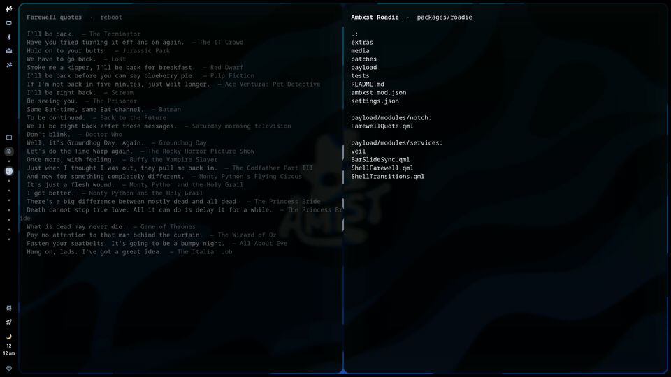
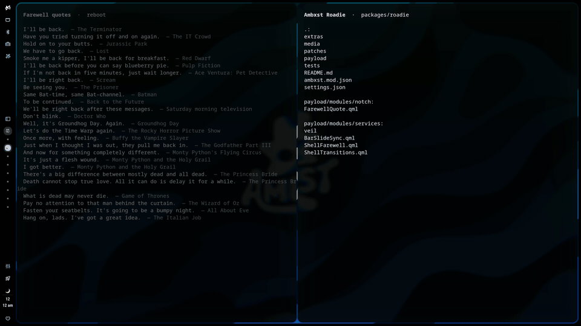
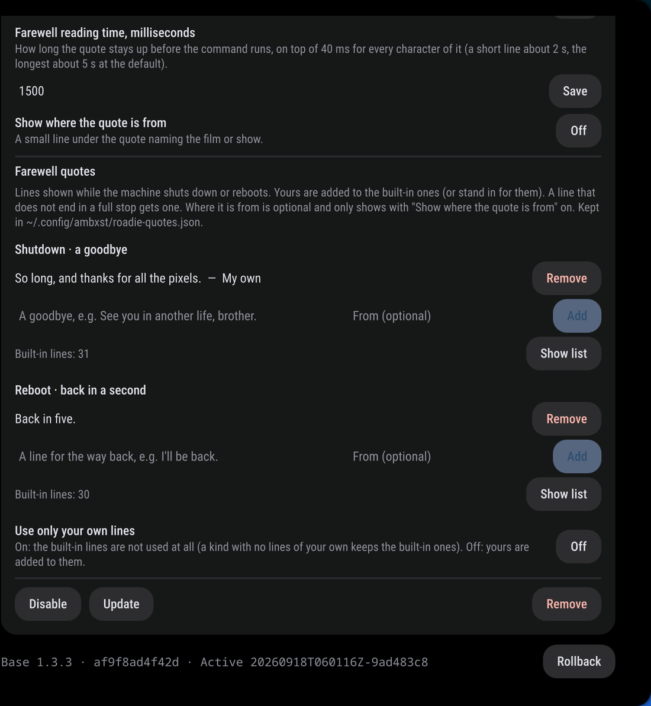
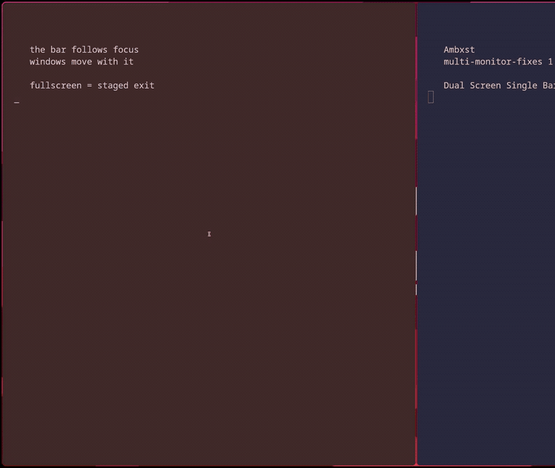
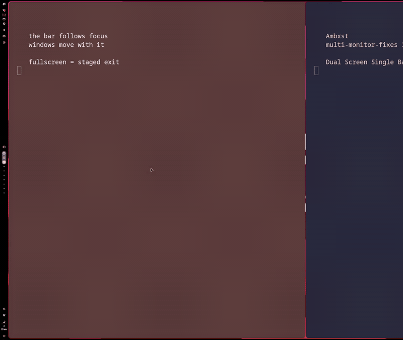
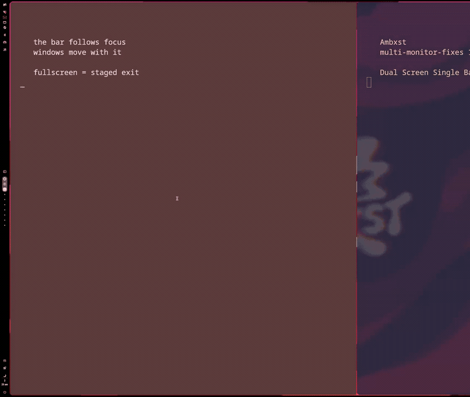
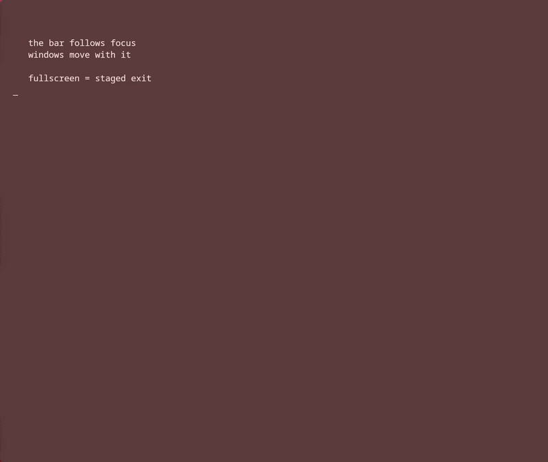
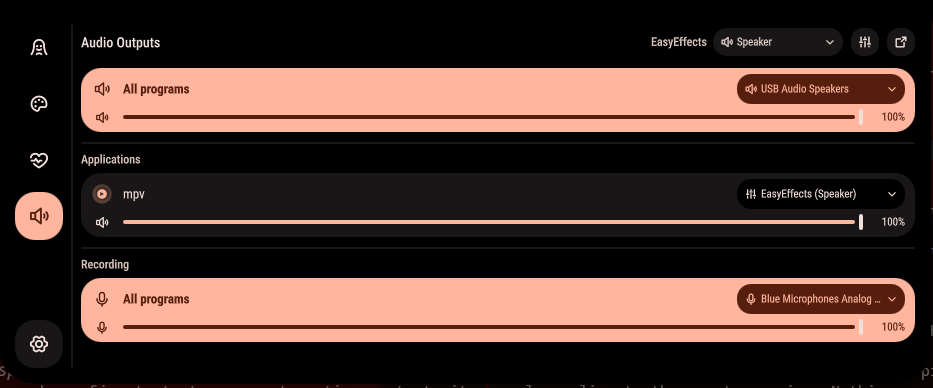
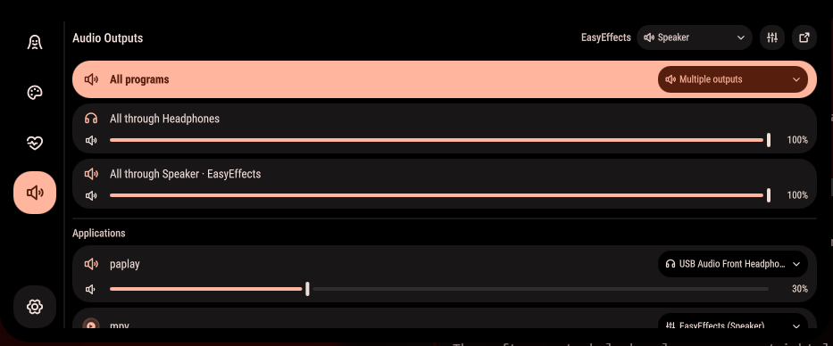
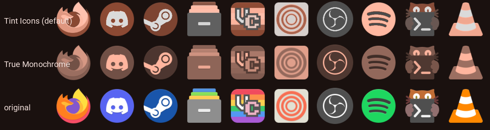

# Ambxst Roadie

The crew that keeps the show running while the stage changes: the shell
starting and reloading, monitors coming and going, focus moving between
screens, a game going fullscreen. Every one of those is a staged movement
with the windows in step, instead of a snap, a blink or a stranded panel.

Since 2.0.0 Roadie is **everything in one package**: one mod to install, one
to update, one to keep in step with Ambxst.

| | |
|---|---|
| **The shell** | [start, reload](#shell-start-and-reload) and [boot](#booting) as one staged movement, a [farewell](#shutting-down-and-rebooting) on reboot and power off |
| **Screens** | [hotplug without a reload, a bar that follows focus, staged chrome around fullscreen windows, notifications on one screen](#monitors-focus-and-fullscreen), [idle dimming](#screens-that-stay-at-their-brightness) for laptops only or never |
| **Bar and notch** | [frame-attached popouts, a Bluetooth widget, night weather glyphs](#bar-at-a-glance), an [audio routing tab](#audio-routing) |
| **Icons** | [True Matugen Icons and True Monochrome](#tinted-icons) |
| **Settings** | a [floating Settings window](#the-settings-window-floats), a [permissions list that fits](#a-permissions-list-that-fits) |
| **Mods** | [update checks](#mod-updates) that say when a mod needs a newer Ambxst *before* anything is installed |

Every feature has a switch or a Stock mode on the [Settings > Roadie](#settings)
page, and **Stock everything** leaves only the fixes.

Roadie replaces **Clean Load**, **Multi-monitor fixes**, **Mod Updater**
(1.4.0), **Settings Float** (1.5.0), **Bar at a Glance**, **Audio Routing** and
**Tinted Icons** (2.0.0). It patches the same files, so it cannot be enabled
together with any of them (the manifest declares the conflict): see
[Coming from the separate mods](#coming-from-the-separate-mods).

| Shutting down | Booting |
|---|---|
|  |  |

## Shell start and reload



Gives Ambxst a fluid way in and out.

Stock Ambxst assembles itself in pieces: the wallpaper pops in whenever its
image has decoded, the frame and bar appear a beat later, and the closed AI
sidebar sweeps across the screen once on the way. `ambxst reload` is worse:
Quickshell is killed outright, so wallpaper, frame and bar vanish in one frame
and the compositor backdrop shows until the new shell has loaded a second or
two later.

With Roadie a reload is one staged movement:

1. **Out** (about 1.4 s). The bar, notch and dock ease out past the screen
   edges first; the frame follows them out a beat later and the windows expand
   into the space; the wallpaper is the slowest, still fading to the theme
   background colour after the rest has gone. Nothing snaps.
2. The shell restarts on a quiet, plain background.
3. **In** (about 0.95 s). The wallpaper starts fading up first; the frame
   closes in from the edges with its rounding while the windows shrink back
   to make room; the bar, notch and dock arrive last, decelerating into place.

A boot has its own sequence, with the lock in the middle of it: see [Booting](#booting).

| leave (L = 900 ms)          | enter (E = 650 ms)          |
|-----------------------------|-----------------------------|
| chrome  0 .. 0.85 L, in-out-cubic | curtain 0 .. 1.4 E, out-cubic |
| frame   0.2 L .. 1.2 L, in-out-cubic | frame 0.2 E .. 1.2 E, out-cubic |
| curtain 0.1 L .. 1.5 L, in-out-sine | chrome 0.45 E .. 1.45 E, out-cubic |

### How it works

**Entering.** A singleton (`ShellTransitions`) drives three staged channels
(`progress` for the frame, `chromeProgress` for bar, notch and dock, `curtain`
for the wallpaper sheet) once the bar and theme config are loaded, the
compositor's monitor and window state has arrived, and the first wallpaper
image has decoded. The frame's thickness and inner radius scale by the first,
the bar, notch and dock offsets by the second, a sheet in the theme background
colour sits over the wallpaper at the third's opacity, and the reservation
windows only reserve space while the frame is in place, which is what makes
the compositor's windows follow. Waiting for the compositor state matters:
until it arrives the notch and dock believe the workspace is empty and reveal
themselves, only to hide again a moment later.

**Leaving.** Quickshell exits about ten milliseconds after the `SIGTERM`
that `ambxst reload` sends, without running any QML teardown, so the shell
cannot animate out once the reload has been issued. It has to leave first.
Three entry points do that:

- `ambxst run reload` (also usable as a keybind command) leaves, then issues
  `ambxst reload` itself when the animation is done.
- `qs ipc --pid $(cat $XDG_RUNTIME_DIR/ambxst-qs.pid) call roadie reload`
  does the same over IPC; `... call roadie leave` only plays the
  animation and returns how many milliseconds it takes.
- **The `ambxst` wrapper in `extras/`** makes a plain `ambxst reload` typed
  anywhere (terminal, the stock keybind, the launcher action, the Mods panel's
  "Restart now") do the same. Install it earlier in `PATH` than the real
  binary:

      cp extras/ambxst-wrapper ~/.local/bin/ambxst && chmod +x ~/.local/bin/ambxst

  Every other subcommand passes straight through. If the shell is not running
  or does not answer within a second, the real reload runs at once.

  Shells that were already open when you installed the wrapper still have the
  real binary cached: run `hash -r` in them (or open a new terminal), or a
  plain `ambxst reload` there is a cold kill and the windows snap instead of
  following the frame.

**The veil.** For a cold kill without the wrapper (a plain `ambxst reload`,
the watchdog, a crash), a tiny detached Quickshell helper (`veil/Veil.qml`)
that the shell keeps connected over a local socket maps the last wallpaper and
frame the instant the shell's socket closes, plays the leave animation itself
(frame collapses into the edge, wallpaper fades to the background colour), and
holds that until the new shell reports its wallpaper is up. It is idle and
windowless while the shell runs, imports nothing from the shell, and exits
after each reload; the new shell spawns a fresh one.

**Windows move with the frame.** The compositor moves the windows into and
out of the frame's space with its own resize animation, which on Hyprland is
`windowsMove` (250 ms by default), so they used to snap ahead of the frame.
For the duration of a transition the mod retunes `windowsMove` to the frame
channel's duration and easing over `hyprctl eval`, then restores what was
there (the effective value, walking up to `windows` or the global default if
`windowsMove` itself was not set). The original is also written to
`$XDG_STATE_HOME/ambxst/roadie-windowsmove.json` for the duration,
so a shell killed mid-transition still gets it restored by the next one.
Hyprland only; other compositors are left alone.

**Corner windows.** Stock Ambxst creates its screen-corner windows before the
theme file has loaded, so they flash as bare boxes at every screen corner for
a moment; they now wait for the theme and only exist while the frame is in
place.

**Volume and brightness pop-ups.** The on-screen display shows whenever the
audio or brightness service reports a change, and both also report while
reading their initial state after a start: the PipeWire sink and source sync
within the first second or so, and every monitor reports the moment its first
brightness read lands, which over DDC can be ten seconds after the shell came
up. So the pop-up plays over the entry, or long after it, on every reload. By
default the mod swallows exactly those reports: volume and microphone while
the start window is open (the entry plus 1.5 s), brightness when the report is
the one that turned its monitor ready (which also covers the re-read after a
wake or a monitor hotplug). A real key press or slider change still shows it.
The display can also be turned off altogether.

**Sidebar fix.** The AI assistant sidebar's slide was a `Behavior` on its
`x`, and `x` depends on the panel width, so the first layout (panel width 0 to
screen width) and the config-driven width change both played the slide with
the sidebar visible. It now animates only when it is actually opened or closed.

## Booting


The first shell start of a session is a boot (every later one is a reload; a
marker in the session's runtime dir tells them apart). At boot:

1. The screen stays in the theme background colour, on every monitor, from
   the shell's first frame until the shell is ready.
2. The wallpaper fades in and the frame comes in -- as a
   plain gutter, with no bar in it: the bar is held away (as on an unfocused
   screen), and the notch and dock stay off screen if a lock is coming.
3. The shell **locks** with the Ambxst lockscreen. **Lock after boot** decides:
   *Auto* (default) locks unless you logged in through a greeter -- SDDM, GDM,
   LightDM, greetd, ly and friends, read from the PAM service name logind keeps
   for the session, so an *autologin* through one of them still locks -- or an
   external locker such as hyprlock is already running; *Always* and *Never*
   skip the detection.
4. When you unlock, the bar slides in with the windows making room, the way
   it arrives when focus reaches a screen, and the notch and dock enter as
   they do after a reload.

What is on screen *before* the shell's first frame is the compositor's: on
Hyprland set `misc { disable_hyprland_logo = true, force_default_wallpaper = 0,
background_color = 0x000000 }` (or the theme background) so the boot is plain
until the shell is up.

`qs ipc --pid $(cat $XDG_RUNTIME_DIR/ambxst-qs.pid) call roadie bootPreview`
forgets that the session has started and reloads, so the next start plays the
boot sequence, lock included; `bootState` prints what was detected.

## Shutting down and rebooting

| Power Off: a goodbye | Reboot: back in a second |
|---|---|
|  |  |

**Reboot** and **Power Off** in the notch's power menu say goodbye first:

1. The menu's buttons dissolve and the notch swells until it is the whole
   screen, on every monitor in step (900 ms, ease-in-out). The bar's pills and
   the dock fade to black over the first 70% of that, so the notch's edge never
   wipes them out.
2. A line from a film or show fades in at the centre of the screen the menu
   was used on: a goodbye for a shutdown ("See you in another life, brother."),
   a back-in-a-second for a reboot ("Hold on to your butts."). Every line ends
   in a full stop. None repeats until all of its kind have been shown. The
   quote is always ONE line: it is set at 2.6% of the screen's height and, where
   that would not fit in 86% of the width (an upright screen, a wide font, a
   very long line of your own), at the largest size that does.
3. It stays up long enough to read -- 1.5 s plus 40 ms per character -- and
   only then does the command run. The quote stays until the session is gone.

**Escape** backs out at any point before the command runs and plays it all in
reverse. A click, Return or Space ends the reading pause once the quote is fully
up. If the command fails, or the machine is somehow still up 20 s later, the
farewell backs out on its own.

### Add your own quotes



Open **Settings > Roadie** and scroll to **Farewell quotes**: type a line (and, if you like, where it is from),
press Add. Your lines are listed there with a Remove button, each built-in line
can be hidden and shown again from **Show list**, and **Use only your own
lines** drops the built-in ones altogether. Everything applies at once, no
reload.

It all lives in `~/.config/ambxst/roadie-quotes.json`, which you can also edit
by hand (there is a copy to start from in `extras/roadie-quotes.example.json`).
The file is watched, so a change is picked up without a reload:

```json
{
  "shutdown": [{ "text": "So long, partner.", "source": "Toy Story 3" }, "A plain string works too."],
  "reboot": [],
  "hidden": ["I'm finished."],
  "replace": false
}
```

They are added to the built-in lists (31 goodbyes, 30 back-in-a-seconds), or
stand in for them with `"replace": true`. An entry is either a plain string or
`{ "text": ..., "source": ... }`; the source only shows with **Show where the
quote is from** on. `hidden` lists built-in lines to leave out. Any length
works -- a long line is simply set smaller, and a line without a full stop at
the end gets one.

Over IPC (`qs ipc --pid $(cat $XDG_RUNTIME_DIR/ambxst-qs.pid) call roadie ...`):
`shutdown` and `reboot` do what the buttons do; `farewellPreview shutdown|reboot`
plays the whole thing and backs out without running anything; `farewellCancel`
is the Escape key; `farewellState` is for diagnostics. The quotes file has the
same commands the editor uses: `farewellQuotes`, `farewellAdd shutdown|reboot
"<line>" "<from>"`, `farewellRemove shutdown|reboot <index>`, `farewellHide
"<built-in line>" true|false`.

How it is wired: the stock `ActionGrid` runs a button's `command` itself, right
after it signals the power menu, so an early return in the menu's handler stops
nothing. While the farewell is on, the two buttons carry no `command` at all;
what they run travels as `powerCommand`, which only `ShellFarewell` executes.

## Monitors, focus and fullscreen

| Focus arrives: the bar slides in, the windows make room | Focus leaves: the bar slides out, the windows take the space |
|---|---|
|  |  |

| A window goes fullscreen: the game lands, the bar slides out, the corners straighten, the gutter settles | Fullscreen ends: the frame returns as one motion, then the bar, with the windows |
|---|---|
|  |  |

Left edge of a 4K screen, real time. The whole sequence: [demo.mp4](media/demo.mp4) (22 s, 1080p60).

- **Unplugging a monitor no longer breaks a surviving one.** When an output
  goes away, Quickshell reassigns the dying panel window's `screen` to a
  surviving output, so a panel that unregistered itself by `screen.name` at
  teardown was deleting a *live* screen's entry from the visibility registry
  and leaving the dead one behind. The survivor then had no bar, dock or
  notch panel to resolve its reveal and pinned state from, which is the
  "windows spill under the bar until reload" symptom. Panels now latch the
  name they registered under at creation and unregister by that, and the
  registry ignores an unregister that doesn't come from the registered owner.
- **The wallpaper manager survives losing its screen.** One Wallpaper instance
  owns scanning, matugen and thumbnails for the whole shell. If its monitor was
  unplugged that role died with it and every other screen kept a wallpaper it
  could no longer rescan or re-theme. The role is now handed to a surviving
  instance, carrying the current state across so nothing blanks.
- **No more invisible view stuck in the notch.** Moving an open module to the
  newly focused monitor could set and clear a screen's flag inside one event
  loop turn, leaving a deferred push behind that parked a hidden 900 px view
  in the notch. The push re-checks the flag and the close unwinds the stack.
- **Fullscreen games on a special workspace are detected.** The panel only
  caught them through a fast path gated on the focused monitor, so the shell
  came back over the game whenever focus moved. The output's open special
  workspace is now read from Hyprland and matched in the window scan as well
  as its active workspace, so the detection no longer depends on focus. On
  Hyprland the scan also reads the compositor's own per-window records
  (`Hyprland.toplevels`, primed once and refreshed on the `fullscreen`
  event): axctl enriches a new window's geometry and fullscreen state a few
  seconds after it appears, and not at all for windows created after a
  monitor hotplug, so a game that went fullscreen straight after launch was
  missed until then. Ambxst 1.3.9 dropped that fast path itself (it ANDed
  the focused toplevel with the focused monitor, two sources that update
  independently, so on every swap away from a fullscreen window the *other*
  screen briefly believed it had one) and scopes its own check to the
  monitor. Its scan still matches the active workspace only, and axctl's
  records only, so the two additions above are what Roadie keeps.
- **No dead strip where a hidden bar used to be.** Going fullscreen hides the
  bar, the dock and the frame, but their layer-shell exclusive zones stayed
  put, so every window below kept a gap against that screen edge. The
  reservation now follows the chrome, screen for screen.
- **The bar stays away from the screen the fullscreen window is on.** Up to
  Ambxst 1.3.8 the bar read fullscreen off the *focused* toplevel, so it hid
  on every screen at once and came straight back the moment focus moved to
  another monitor -- over a game that was still fullscreen. Ambxst 1.3.9
  scopes that to the monitor itself, so this part is stock now; the bar, dock
  and notch here go by the panel's per-output state, which is the same idea
  plus the special workspace and Hyprland's records (above). What Roadie
  still adds on that screen: the pointer does not bring the bar or dock
  back -- sweeping the cursor off the game towards the next monitor crosses
  the bar's edge, which flashed it up over the game for the hide delay -- while
  a notch the user deliberately opens still reveals the bar; and the exit is
  staged rather than instant, see "What the fullscreen slide assumes" below.
- **The windows move with the bar.** When the bar slides away for a
  fullscreen window its exclusive zone is released and the compositor moves
  the windows into the space with its own resize animation -- on Hyprland
  `windowsMove`, which Ambxst sets to 250 ms, so the windows arrived first and
  the bar trailed in. For the length of a slide `windowsMove` is retuned to
  near-instant, and the exclusive zone is walked frame by frame along the
  bar's own slide instead of being switched, so the compositor lays the
  windows out against a value that moves with the pills and the frame slab
  -- one number, committed in the same frame, rather than two animations
  started a frame apart -- then restored once things are quiet. The restore
  re-reads Hyprland first and only writes the originals back if `windowsMove`
  still carries this mod's curve; the originals are also kept on disk so a
  shell killed mid-slide is put right by the next one. Hyprland only.
- **Hiding or showing the special workspace is followed instantly.** The
  screen's open special workspace is tracked from Hyprland's own
  `activespecial` event rather than read back from Quickshell's monitor
  object, which does not refresh on that event and whose refresh, when
  requested, could be folded into one already in flight with a stale reply.
  Before, the bar sometimes stayed away from a screen showing ordinary
  windows again, or the frame and bar stayed over a game that had just come
  back.
- **Dual Screen Single Bar.** A pinned bar shows on the focused screen only
  and slides across when focus moves -- out here, in there, on the same
  slide, its space walked with it so the windows on both screens move in
  step. The focused screen only hides its bar for a fullscreen window it
  holds itself. A switch in **Settings > Roadie** (`followFocus`) turns it
  off; off restores a bar on every screen, each one hiding only for a
  fullscreen window of its own, as stock does since 1.3.9 (the "hide on every
  screen in sympathy" rule of earlier versions went with it).
- **Notifications on one screen.** Stock pops every notification in every
  screen's notch at once. Now the notch on the focused screen pops it and the
  others stay quiet. If a fullscreen window covers the focused screen and
  another screen is free, it goes to that screen instead -- the one focus was
  on last if it qualifies, else the first free one -- so a game is never
  interrupted while there is somewhere else to look. With a single screen, or
  every screen covered, it stays on the focused screen: the dashboard's bell
  already silences notifications for anyone who would rather not see them
  over a game. A switch in **Settings > Roadie** (`notifyFollowFocus`) turns
  it off; off is stock.
- **An auto-hide (unpinned) bar gets the same slide.** Reveal and hide are
  the deliberate slide -- pills and frame slab together, no cross-fade --
  and the bar's space comes and goes with it, so the windows shrink as it
  arrives and grow back as it leaves, in lockstep.
- **Null guards** on about fifteen `screen.name` bindings that threw a
  `TypeError` cascade during teardown.

### What it changes

One patch, fifteen files: `Bar.qml`, `BarContent.qml`, `DockContent.qml`,
`ScreenFrameContent.qml`, `NotchContent.qml`, `NotchWindow.qml`,
`Visibilities.qml`, `GlobalStates.qml`, `UnifiedShellPanel.qml`,
`Wallpaper.qml`, `OverviewPopup.qml`, `PresetsPopup.qml`, `ThemePanel.qml`
(the Dual Screen Single Bar switch), `SettingsIndex.qml` (its search entry),
`shell.qml`; plus new files under `modules/services/`: `BarSlideSync.qml`, the
singleton that holds Hyprland's `windowsMove` during a bar slide and carries
the mod's settings, and `NotificationRouter.qml`, which picks the screen a
notification pops on. `SettingsTab.qml` gets the Roadie sidebar entry and
panel entry as pure insertions, and the entry's section id is looked up
(the panel's own position in the panel list) rather than claimed as a number,
so other mods adding pages, in any load order, cannot make it open the wrong
panel. One mod setting, `followFocus` (settings.json); no new
config keys. Reads
Hyprland monitor state through `Quickshell.Hyprland` for the
special-workspace check; on Hyprland runs `hyprctl eval` for the window
sync and keeps the original animation in
`~/.local/state/ambxst/roadie-barslide-windowsmove.json` while tuned.

Testing hotplug without real hardware: `hyprctl output create headless` and
`hyprctl output remove HEADLESS-N` are faithful add/remove events.

#### What the fullscreen slide assumes, and what it does not

- **Bar position** -- left, right, top or bottom; the slide travels along the
  bar's own axis by the exact size the exclusive zone changes by, which is
  computed from the bar's own target size, outer margin and frame allowance.
- **Screen size and scale** -- everything is in logical pixels on both sides
  (Quickshell and the compositor's reserved area), so HiDPI and mixed-scale
  setups need nothing special.
- **`theme.animDuration`** -- the slide is `1.6 x animDuration`; at `0` every
  animation is disabled and the shell behaves exactly as before.
- **An unpinned (auto-hide) bar** rides the same slide for every reveal and
  hide, and takes its space with it; the auto-hide delay and hover rules are
  untouched.
- **Which screen has the bar** -- with Dual Screen Single Bar on (default),
  the focused one; the focused monitor comes from Ambxst's compositor
  abstraction, so this is not Hyprland-specific, and an unknown focus at
  start never hides every bar.
- **The screen the fullscreen window covers** leaves and returns in stages,
  the way the shell's own enter and leave do: the window's own arrival animation is
  allowed to finish, the bar slides out with the frame's slab following it
  back to the plain gutter (the wrap around the bar keeps its thickness, so
  its edge never shows), then the corners straighten and the gutter settles
  onto the screen edge. When the window goes, the frame returns as one motion
  and the bar slides in after it, synced with the windows.
- **Compositor** -- the window-move sync (`BarSlideSync`) is Hyprland-only,
  and speaks both of Hyprland's config dialects (`hyprctl keyword` for stock
  builds, `hyprctl eval` for Lua configs; each change is issued in both, the
  one the parser does not take fails harmlessly). On Niri or Mango it is
  inert and the slide still runs, with the compositor's own window animation.
  A `hyprctl` that hangs or is missing is given 250 ms, then the slide goes
  ahead without it.
- **One screen, or a bar on some screens only** -- with a single monitor the
  bar is simply always the focused one. If `bar.screenList` excludes the
  screen that has focus, no screen shows a bar until focus moves to one that
  has it; turn Dual Screen Single Bar off if that is not what you want.
- **Other mods** -- the retune is put back only if `windowsMove` still carries
  the bar slide's own curve, so a transition something else has taken over (the
  shell enter/leave, for instance) is never yanked; the original is kept on
  disk so a shell killed mid-slide is restored by the next start.

Works with Ambxst `>=1.3.9`.

## Bar at a glance

More of your system readable straight from the bar, without opening the apps
behind it.

- **Frame-attached popouts.** With *contain bar* on, the clock/calendar, audio
  and brightness controls, battery and power-profile picker, the tiling layout
  switcher, the tray's hidden-icons popup and every tray icon's right-click
  menu (the network applet's, say) grow out of the frame like part of it
  instead of floating as separate pills, in every bar position, and keep
  clear of the frame's corner at the end of the bar. With *contain bar* off
  they stay floating pills, as stock. Switch: *Popouts grow out of the frame*.
- **Bluetooth in the bar.** An indicator that opens a frame-attached flyout on
  hover or click: adapter power, scanning, and connect, disconnect, pair, trust
  and forget per device. Right click opens `blueman-manager`. A second
  indicator shows the battery level of connected devices that report one
  (headsets, controllers, mice, keyboards). blueman's own tray icon is hidden
  so there is one Bluetooth icon in the bar; the `bar.systrayExclude` list in
  bar.json controls that and takes any other tray ids you want gone. Switch:
  *Bluetooth in the bar*; off, the indicators go and blueman's tray icon
  comes back.
- **An Ethernet switch in the notch.** Stock offers one network control in the
  dashboard's quick controls, the Wi-Fi switch, which says nothing to a desk
  that is always on a cable. While a cable is plugged in, an Ethernet switch
  sits to the left of the Wi-Fi one: lit while the wired connection is up,
  click to disconnect it or bring it back (`nmcli device disconnect` /
  `connect`; nothing is stored, a reboot connects as usual). It is there for
  as long as the cable is, on or off, and slides in and out of the row when
  the cable is plugged in or pulled. No cable, no switch, and the row is
  stock. Switch: *Ethernet switch in the notch*.
- **Weather that knows it's night.** The bar's weather glyph switches to moon
  and night variants between sunset and sunrise instead of showing a sun at
  midnight.

**How the popouts work.** Ambxst draws the bar, notch and dock in one
full-screen surface per monitor. A popout that should merge with the frame has
to be drawn in that same surface, or the fill never joins and the frame's
concave fillets can't overlap it, so each widget hands its popout content to
the panel as a `Component` through `GlobalStates` and a single `BarFlyout` per
screen instantiates it. `BarPopout` wraps that: widgets declare their content
inline as before, and it picks the attached or floating form. Only one flyout
is open at a time, shell-wide, and a click anywhere outside it closes it.

## Audio routing

A fourth dashboard tab, under the vitals: every program that is playing audio,
which output it is going to, a slider and a mute for each, and a dropdown to
move it somewhere else, including into EasyEffects. Same again for
microphones. Switch: *Audio routing tab in the dashboard*.



| Row | Dropdown | Slider |
|---|---|---|
| **All programs** | Moves every stream at once and sets the default output, so new programs follow. | System volume: the hardware device the default route ends at. |
| **One program** | Moves just that stream. | That program's own volume. |
| **All programs** *(Recording)* | Default microphone, and moves every recording stream to it. | Microphone gain. |
| **One program** *(Recording)* | Which microphone that program records from. | That stream's gain. |

Click the speaker or microphone glyph on any row to mute it. Rows carry the
program's desktop icon, recoloured to your theme the way the dock and launcher
do it. The titlebar has an **EasyEffects** picker for the device EasyEffects
outputs to, plus buttons to open EasyEffects and pavucontrol. When programs are
split across devices, "All programs" no longer has a single answer, so it says
so and one row per device appears underneath with that device's volume as the
knob.



`ambxst run audio` (or `dashboard-audio`) opens the tab directly, for a
keybind. Needs `pactl` (pipewire-pulse), which Ambxst's own install brings in
along with EasyEffects and pavucontrol.

**EasyEffects: one setting to change.** EasyEffects ships with *Process all
output streams* on. In that mode it pulls every stream into its own sink and
yanks it back half a second after any move, so per-app routing silently does
nothing. Turn that setting off in EasyEffects → Preferences, then pick the
device EasyEffects should feed from the tab's titlebar picker (it pins
EasyEffects to it and restarts EasyEffects for you, since EasyEffects only
reads its config at startup). The tab shows a notice whenever it detects
EasyEffects capturing again. Volume for anything routed through EasyEffects
lives on the device EasyEffects feeds; the `easyeffects_sink` knob itself is a
no-op.

The tab takes whatever index it lands on when the dashboard completes, so
another mod adding a tab the same way gets the next one instead of the same
one.

## Tinted icons

Two switches under *Settings → Theme → Tint Icons*, each usable on its own.
Stock *Tint Icons* is left exactly as Ambxst ships it, and both are off by
default.

- **True Matugen Icons** rethemes app icons in the tray, dock, workspace pills
  and launcher through a lightness ramp built from your theme's primary
  family, so every icon lands in one hue with its own shading intact:
  gradients stay gradients, and the whole set follows whatever matugen
  generated from your wallpaper. The active workspace and the selected
  launcher entry swap to the primary colour. The notch's unread bell, the
  dashboard's clear-notifications broom and the mod update notification's icon
  follow the palette too.
- **True Monochrome** flattens icons to a single colour instead. It wins if
  both are on.



The ramp shader is a port of the colour mapping in
[Iconicul](https://codeberg.org/dvrkxed/iconicul) by dvrkxed (MIT), which
recolours whole icon themes on disk. Each pixel is converted to Lab, its
lightness is remapped onto the ramp's lightness range, the ramp anchors are
blended with a Gaussian window, and the result's chroma is scaled by how
saturated the source pixel was, so anti-aliased greys stay quiet. The ramp is
`background → primaryContainer → inversePrimary → primary → primaryFixed`.
Feeding a lightness mapping the whole palette does not work: matugen's accents
share a lightness band, so they average out into beige. Restricting the ramp
to the primary family is what makes it read as a retheme.

## Screens that stay at their brightness

Ambxst dims when you are away: its first idle rule lowers the brightness of
every screen that can be dimmed to 10% after 2.5 minutes without input and
puts it back when you return. That saves a laptop's battery. On a desktop it
mostly means monitors changing brightness by themselves, over DDC, which is
slow and on some GPUs stalls the desktop for a moment each way.

**Settings > Roadie > Dim the screens when idle:**

| | |
|---|---|
| **As stock** (default) | every machine dims |
| **Laptops only** | dims where there is a battery, leaves a desktop alone |
| **Never** | the screens stay at the brightness you set |

The idle rules themselves (Settings > System) are not edited: a rule whose
command changes the brightness (`ambxst brightness`, `brightnessctl`,
`xbacklight`, `light`, `ddcutil setvcp`) is passed over while dimming is off,
together with its restore command, and works again the moment you switch it
back. Locking, screen off and suspend are not affected. The shell log notes
each time a rule was left alone.

## The Settings window floats

The Ambxst Settings window opens as a centred floating window, sized to the
screen it opens on, instead of tiling into whatever workspace is current.

Until the compositor has placed it, the window declares a fixed size (minimum
equals maximum), derived from the screen it opens on. Compositors treat a
fixed-size toplevel like a dialog and float it the moment it maps, so it never
appears as a tile first and never reflows the workspace. Hyprland and Niri also
centre it on their own, keeping clear of bars. Once the stock placement code
sees the window in the compositor state, the constraints are released so you
can resize it by hand. Nothing is added to your compositor config.

| | default |
|---|---|
| width | 41% of the screen, at least 900 px, at most 92% |
| height | 66% of the screen, at least 650 px, at most 92% |

On a 3440x1440 ultrawide that is 1410x950; on 1920x1080 it is 900x713; on a
1366x768 laptop panel it is 900x650. The switch and the two percentages are on
the Settings > Roadie page and apply the next time Settings is opened.

- The hint only matters at map time. If you float or tile the window yourself
  while it is open, Roadie does not fight you.
- A compositor that does not float fixed-size windows tiles it exactly as
  stock Ambxst does; add a rule for `org.quickshell` + title `Ambxst Settings`
  there. Hyprland, Niri and dwl-based compositors honour the hint.
- There is deliberately no "float it through the compositor" fallback: Ambxst's
  compositor state reports a window floated at map as not floating, and acting
  on that flag tiled the window it was meant to float.

## Mod updates

Settings > Mods gets a **Check for updates** button next to the search box.
It asks each installed mod's source for its current manifest and compares
versions; with nothing newer it reads *No updates* for a moment, then fades
back. When newer versions exist it becomes **Install N updates**, and every mod
with an update gets its own **Update to x.y.z** button next to Enable/Disable.
Installs go through the mod manager's normal update path, so each one rebuilds
the generation and the usual "Restart Ambxst" banner and rollback apply.

Two switches (under *Bypass Ambxst version check*, and in Settings > Roadie):
**Check for mod updates automatically** -- about 90 seconds after the shell
starts and then every few hours (default 6), with a notification offering *Open
Mods*, *Later* (snoozes 8 h) and *Update all* -- and **Install mod updates
automatically**, which installs what a check finds and then offers *Restart
now*. The shell never restarts itself.

The notification's icon wears your theme the way the shell's other icons do:
it follows *Tint Icons*, and *True Matugen Icons* / *True Monochrome* where the
Tinted Icons mod is installed. With none of those on it is the plain icon from
your icon theme.

### A permissions list that fits

A mod declares what it does in its manifest, one sentence per permission, and
Settings > Mods printed every one of them, in the mod's details and in the
dialog that asks before a mod is enabled. With a long list that dialog grew
past the window and its **Enable** button was out of reach. Now the list is cut
at about 140 characters (at a word) with **Show all N** under it. Opened, it is
one permission per line in a box that stops growing and scrolls from there,
with a scroll bar, and **Show less** closes it. A list that fits is shown
whole, as before.

### Updates that need a newer Ambxst

A mod's manifest says which Ambxst versions it is for. When a mod's *new*
version needs a newer Ambxst than the one you run, there is no good order to do
things in by hand:

- **Mod first:** the mod manager refuses it, and tells you only after you
  clicked: `Ambxst 1.3.8 does not match ">=1.3.9 <2.0.0"`.
- **Ambxst first:** `ambxst update` rebuilds the mods you *have*. The version
  you have was written for the old Ambxst; if it no longer applies the build
  fails, **one failing mod fails it for all of them**, and Ambxst starts with
  no mods at all -- this checker included, since it is one. (Stock Ambxst then
  also drops the config keys your mods had added.)

So Roadie reads the range from the new version's manifest during the check and
says so up front:

- the mod's button reads **x.y.z needs Ambxst a.b.c** instead of *Update to
  x.y.z*, and such an update is never part of *Install N updates* or of an
  automatic install;
- a second button appears beside *Check for updates*: **Update Ambxst to a.b.c
  and its mods** -- or **Waiting for Ambxst a.b.c** if that version is not out
  yet, in which case there is nothing to do but wait;
- the update notification says the same, with an *Update Ambxst too* action.

**Update Ambxst and its mods** opens a terminal (Ambxst's installer asks for
your password), lists what it is about to do, asks, and then:

1. sets the mods that need the new Ambxst aside (disabled; the running shell
   is not restarted and keeps them on screen) and fetches their new versions
   -- the manager does not check a disabled mod against the Ambxst version;
2. runs Ambxst's own installer, the one `ambxst update` runs;
3. enables those mods again, now at their new versions, and installs the other
   updates that were waiting;
4. rebuilds and restarts Ambxst, once.

Until Ambxst itself has been updated, any failure puts everything back as it
was -- packages, the mod list, the generation -- and the shell is never
restarted. After that point there is no way back to the old Ambxst, so the
script carries on and reports what did not go through. The previous packages
are kept in `~/.cache/ambxst/roadie-update-backup-*` until everything has
succeeded.

If you have turned on *Bypass Ambxst version check*, nothing is held back: you
asked for that.

How the latest version is found:

| Source type | Where the latest version comes from |
|---|---|
| local directory | `ambxst.mod.json` in the source directory |
| git clone (plain Git URL) | `git fetch` in the package clone, manifest read from the fetched head |
| GitHub tree URL (`…/tree/<ref>/<dir>`) | the manifest fetched from raw.githubusercontent.com, no clone needed |
| archive | cannot be checked |

Only the version field decides; a source that changed without bumping its
version does not show as an update. The Ambxst version an update would bring
is read from the `version` file on Ambxst's main branch.

`qs ipc --pid $(cat $XDG_RUNTIME_DIR/ambxst-qs.pid) call roadie updateCheck`
runs a check and `... call roadie updateState` prints what the last one found;
`... call roadie updateCheckAuto` runs it the way the automatic one does,
notification included.

**For mod authors:** raise `compatibility.ambxst` in the release that needs
the new Ambxst (`">=1.3.9 <2.0.0"`). That one line is what lets your users be
told in time.

## Settings

Roadie has its own page in the Settings window, **Roadie**, just above Ambxst.
Everything applies as you change it, and it is kept in
`~/.config/ambxst/roadie.json` (only what differs from the defaults; edit it by
hand if you like, it is watched).

The page has three groups behind the switch at the top. It opens on
**Features** the first time and on the group you used last after that.

**Features** is what Roadie does, each with a switch. Off is what plain Ambxst
does there.

| Group | Switches |
|---|---|
| Shell | Staged shell start · Staged reload · Cover a sudden restart · Lock after boot · Farewell on reboot and power off |
| Screens | Bar follows the focused screen · Notifications follow the focused screen · Staged bar slide · Animated frame around fullscreen windows · Notch hangs off the edge over fullscreen · Remember the monitors' brightness channels |
| Bar and notch | Bluetooth in the bar · Popouts grow out of the frame · Audio routing tab in the dashboard · Ethernet switch in the notch |
| Settings and mods | Settings opens as a floating window · Check for mod updates automatically |

**Behaviours** is how the features that are switched on behave: Bar slide
(Animated / Immediate) · Farewell (Animated / Immediate) · Show where the quote
is from · Lock after boot (Auto / Always) · Dim the screens when idle (As stock
/ Laptops only / Never) · Volume and brightness pop-ups (Quiet at start / As
stock / Off) · Install mod updates automatically · Hours between automatic
checks.

**Customization** is their durations, sizes and quotes: the animation
durations (clear a field for the normal one; where that is derived from
Ambxst's animation speed the field reads "auto"), the Settings window's width
and height, and the farewell quotes editor.

| Duration | Normally |
|---|---|
| Shell start | 650 ms (the frame; wallpaper and bar are paced from it) |
| Reload, the way out | 900 ms |
| Bar slide | auto: 1.6 x Ambxst's animation speed contained in the frame, 1.2 with a frame or bar background, 0.9 for pills alone |
| Frame around a fullscreen window | auto: Ambxst's animation speed |
| Farewell | 900 ms to fill the screen, then 1500 ms + 40 ms per character to read |

Behaviours and Customization only list what belongs to a feature that is
switched on: turn the farewell off and its style, its durations and the quotes
editor leave the page with it. Dimming and the pop-ups are always there, since
they are Ambxst's own.

**Stock everything** in the title bar switches every feature off in one go,
for anyone who wants Roadie only for its fixes -- the stranded bar, the stale
fullscreen detection, corners over a game on an unfocused monitor and the
monitor hotplug fixes have no switch. The button beside it resets the page to
Roadie's defaults. The two icon switches, True Matugen Icons and True
Monochrome, are under Settings > Theme with Tint Icons.

Options set in Settings > Mods before 1.1.0, and in the mods Roadie has taken
in since, are carried over the first time.

## Install

```
https://github.com/drpezzer/ambxst-mods/tree/main/packages/roadie
```

Paste that into **Settings → Mods**, or:

```bash
ambxst mods disable drpezzer.clean-load            # if you have them
ambxst mods disable drpezzer.multi-monitor-fixes
ambxst mods disable drpezzer.mod-updater
ambxst mods disable drpezzer.settings-float
ambxst mods disable drpezzer.bar-glance
ambxst mods disable drpezzer.audio-routing
ambxst mods disable drpezzer.tinted-icons
ambxst mods install https://github.com/drpezzer/ambxst-mods/tree/main/packages/roadie
ambxst mods enable drpezzer.roadie
ambxst reload
```

Works with Ambxst `>=1.3.9` (Roadie 1.3.0 is the last one for 1.3.6 to
1.3.8). Coming from the two old mods: settings do not
carry over (a mod's settings are keyed by its id), so copy the values from
`~/.config/ambxst/mods/drpezzer.clean-load.json` and
`drpezzer.multi-monitor-fixes.json` into `drpezzer.roadie.json`, or set them
again in the panel. The optional `extras/ambxst-wrapper` (install it as
`~/.local/bin/ambxst`) answers to both this mod and Clean Load, so a copy you
already installed keeps working.

### Coming from the separate mods

Roadie cannot be enabled next to a mod it has taken in: Mod Updater, Settings
Float, Bar at a Glance, Audio Routing, Tinted Icons. Updating Roadie while one
of them is enabled fails with `mods drpezzer.roadie and drpezzer.<that mod>
conflict`; that message means exactly this.

In Settings > Mods: **Disable** each of those you have, then press **Update to
x.y.z** on Roadie, then restart. **Do not restart in between.** Bar at a
Glance and Tinted Icons add config keys (`bar.systrayExclude`, the two icon
switches), and a shell started with neither them nor the new Roadie drops
those keys from your config. Or, in a terminal, in one go:

    for mod in mod-updater settings-float bar-glance audio-routing tinted-icons; do
        ambxst mods disable drpezzer.$mod 2>/dev/null
    done
    ambxst mods update drpezzer.roadie && ambxst reload

What you had set in any of them is carried over. Afterwards the old mods can
be removed (`ambxst mods remove drpezzer.<mod>`).

## Notes

- The compositor's own backdrop shows for the second or two the restart
  takes, so set it to your theme background. On Hyprland:

      misc { disable_hyprland_logo = true; force_default_wallpaper = 0; background_color = 0x000000 }

  (Ambxst's OLED mode uses pure black; otherwise use your theme's background.)
- The helper costs 50-100 MB of private memory while idle and nothing on the
  GPU. With `ambxst quit` there is no new shell; it drops the wallpaper after
  12 s and exits.
- Video and GIF wallpapers are held as the still frame Ambxst already caches
  for the lockscreen.
- On Hyprland the helper's surfaces use the `ambxst:` namespace prefix so the
  layer rules Ambxst generates (no animation, blur) apply to them too.
- The mod does not wait for `Config.initialLoadComplete` on purpose: that flag
  also waits for optional config files (`ai.json`, `general.json`,
  `prefix.json`) and never comes true on an install where they are absent.
- After a transition Hyprland reports `windowsMove` as overridden with the
  values it had effectively before; that is the same behaviour unless you
  later change `windows` and expect `windowsMove` to follow. Ambxst reloads
  the Hyprland config at every shell start anyway, which resets it.
- `setsid` (util-linux) is used to detach the helper from Quickshell's process
  group, which the Ambxst daemon kills as a whole on shutdown.
- For diagnostics: `qs ipc --pid $(cat $XDG_RUNTIME_DIR/ambxst-qs.pid) call roadie state`
  (`osdSwallowed` counts the initial-state pop-ups that were held back, per
  screen, since the shell started).

## Changelog

- 2.1.0: **Ethernet and networking.** An **Ethernet switch in the notch**:
  while a cable is plugged in, the quick controls get a switch for the wired
  connection to the left of the Wi-Fi one, and it slides out again when the
  cable is pulled (new switch under *Bar and notch*, on by default, off with
  "Stock everything"). And the **tray icons' right-click menus** (the network
  applet's included) are frame-attached popouts now, like the bar's other
  popouts, with the same clearance from the frame's corner; icons inside the
  hidden-icons popup keep their floating menu. New command used: `nmcli`.
  Also a fix for a stock leak: Ambxst's daemon leaves one `nmcli monitor`
  process behind on every reload, for the rest of the session; Roadie ends
  the leftovers at each shell start (only ones nobody is reading any more).
- 2.0.1: **no more faint arc in the screen corners.** With the frame on, each
  rounded screen corner carried a one-pixel arc of nearby colour across the
  frame, easiest to see on a black (OLED) frame. A stock bug: the corners are
  a window of their own, and the compositor's blur showed through their
  antialiased edge. With the frame on they are now drawn in the frame's own
  surface (one full-screen layer less per monitor); without a frame nothing
  changes. No switch, it is a fix.
- 2.0.0: **everything in one package.** Bar at a Glance, Audio Routing and
  Tinted Icons are part of Roadie now, exactly as they were: the combined shell
  is line for line the one the four separate mods built. One patch, one
  package to keep in step with Ambxst. New on the Settings > Roadie page, under
  *Bar and notch*: **Bluetooth in the bar**, **Popouts grow out of the frame**
  and **Audio routing tab in the dashboard**, each on by default, off with
  "Stock everything". With the Bluetooth widget off, blueman's tray icon comes
  back. The two icon switches stay under Settings > Theme. The manifest's
  permissions were rewritten as eleven short lines. **The Settings > Roadie
  page is three groups now**, Features, Behaviours and Customization, behind a
  switch at the top that remembers the one you used last; the second and third
  only list settings of features that are switched on. **Popouts keep clear of
  the frame's corner:** a tall popout on the last button of the bar (the clock
  and weather one on a vertical bar) ended 28 px from the screen edge, where
  its curve ran into the frame's own rounded corner. Conflicts with
  `drpezzer.bar-glance`, `drpezzer.audio-routing` and `drpezzer.tinted-icons`,
  which are superseded; see [Coming from the separate
  mods](#coming-from-the-separate-mods).
- 1.6.2: **the Enable button is no longer pushed out of the window by a long
  permissions list.** "Declared permissions" in Settings > Mods (the details
  and the dialog that asks before enabling) shows about 140 characters and a
  "Show all N" link; opened, one permission per line in a scrolling box with a
  scroll bar. `ModsPanel.qml`: a new `PermissionsRow` replaces the two rows
  that printed the whole list.
- 1.6.1: the mod update notification's icon follows the theme. It is drawn
  through the same tint as the dock and tray icons (Tint Icons, and Tinted
  Icons' True Matugen Icons / True Monochrome where that mod is installed)
  instead of in the icon theme's own colours. Only Roadie's notifications are
  touched; every other notification keeps the icon its app sent.
  `NotificationAppIcon.qml` joins the patch (insertions only). New IPC:
  `updateCheckAuto`.
- 1.6.0: **Dim the screens when idle: As stock / Laptops only / Never**
  (Settings > Roadie, `idleDim`). Ambxst's idle rule that lowers the
  brightness after 2.5 minutes can be kept for machines with a battery or
  turned off, so a desktop's monitors stay at the brightness you set. The idle
  rules are not edited; brightness rules are passed over, restore command
  included, and everything else (lock, screen off, suspend) runs as before.
  `IdleService.qml` joins the patch (insertions only). Default is stock.
- 1.5.0: **Settings Float is part of Roadie now.** The Settings window opens
  floating and centred, sized to its screen, exactly as that mod did it (the
  fixed-size hint until the compositor has placed the window). Its switch and
  the two percentages moved to the Settings > Roadie page
  (`settingsFloat`, `settingsFloatWidth`, `settingsFloatHeight` in
  `roadie.json`; "Stock everything" turns it off) and are carried over once.
  They are read from Roadie's settings, which are loaded synchronously at
  start, so the separate start-up singleton and its line in `shell.qml` are
  gone; `SettingsWindow.qml` joins the patch. Conflicts with
  `drpezzer.settings-float`, which is superseded.
- 1.4.0: **Mod Updater is part of Roadie now**, and **updates that need a
  newer Ambxst say so before anything is installed.** The check reads the
  Ambxst range from each new version's manifest; an update the installed Ambxst
  does not match is shown as "x.y.z needs Ambxst a.b.c", is never installed on
  its own (the manager would refuse it, and updating Ambxst first can leave the
  shell without any mods), and is offered together with the Ambxst update:
  "Update Ambxst to a.b.c and its mods" opens a terminal that sets those mods
  aside, fetches their new versions, runs Ambxst's installer, enables them
  again and restarts once, putting everything back if anything fails before
  Ambxst itself was updated. See [Mod updates](#mod-updates). New files:
  `modules/services/ModUpdateService.qml`, `mod_update_check.sh`,
  `roadie_update.sh`; `ModsPanel.qml` gets the buttons and switches (pure
  insertions) and `shell.qml` one line. The switches moved to
  `~/.config/ambxst/roadie.json` (also on the Settings > Roadie page) and are
  carried over from Mod Updater once. IPC: `updateCheck`, `updateState`.
  Conflicts with `drpezzer.mod-updater`, which is superseded; needs `git` and
  `curl`.
- 1.3.1: **ported to Ambxst 1.3.9** (base 3705f278), which is now the
  minimum. 1.3.9 scopes its own fullscreen detection to the monitor and drops
  the focused-toplevel fast path, two things Roadie had been doing on its own,
  so those are upstream's now and the patch builds on them. Kept, because
  upstream's check still scans the active workspace and axctl's records only:
  a game on the output's open special workspace counts, and Hyprland's own
  window records have the last word. The notch goes by the panel's per-output
  state again (upstream moved it to its own scan, which would have brought it
  back over a game on a special workspace). Removed: with "Bar follows the
  focused screen" off, a fullscreen window no longer hides the bar on the
  *other* screens in sympathy -- that was stock behaviour being preserved, and
  stock no longer does it. Everything else applies unchanged.
- 1.3.0: **Settings page no longer claims a section id.** The Roadie entry
  used to be inserted as `section: 11`, and Ambxst's panel Loader indexes the
  panel list by position: another mod adding a page ahead of it in load order
  would have shifted the panel one slot and the sidebar entry would have opened
  that mod's panel (or its own entry, ours). Both entries are still pure
  insertions, but `section` is now a getter that returns the Roadie panel's
  own position in the panel list at the moment it is read, so it is right in
  any load order next to any other page-adding mod. No dependency, no other
  file touched.
- 1.2.1: notification routing only considers screens that have a shell panel and are connected, so a screen left out of `bar.screenList` (no notch there) is never chosen and a focused screen without one counts as covered; a panel rebuilt during a hot-plug no longer has its state dropped by the old panel's teardown.
- 1.2.0: **Notifications on one screen.** The notch pops a notification on the focused screen only; if a fullscreen window covers it and another screen is free, on that screen instead; with one screen (or all covered) it stays put. Settings > Roadie > "Notifications follow the focused screen" (`notifyFollowFocus`, on; stock: off). New `modules/services/NotificationRouter.qml`; `UnifiedShellPanel.qml` reports each screen's fullscreen state to it; `NotchContent.qml` / `Notch.qml` take the routed flag.
- 1.1.2: verified on Ambxst 1.3.8+1 (base 2a704c43, workspace icon pixel-centering fix); patch applies verbatim, no source changes.
- 1.1.1: verified on Ambxst 1.3.8 (base c62a7acc); patch applies verbatim, no source changes.
- 1.1.0: **No more lag spike after a reload.** Every shell start, Ambxst asks
  the monitors over DDC which I2C bus is which (`ddcutil detect`) and what their
  brightness is. DDC traffic blocks the display driver: on an NVIDIA desktop with
  two DDC monitors that froze the compositor for 1.2 s in total, two seconds into
  every reload and under the shell's own entrance, and wrote a level the monitor
  already had ten seconds later for another 0.4 s. Roadie now remembers the
  buses and levels for the session (in `$XDG_RUNTIME_DIR`, keyed by the connected
  monitors; a changed monitor set or a wake from suspend asks again) and skips
  writes that would change nothing. Measured against Hyprland's request socket:
  1565 ms of stalls per reload before, 0 after. The first start after a boot
  is covered too: the bus map is kept in `~/.cache/ambxst/roadie-ddc.json` and
  reused only if the same monitors are connected and each bus still has the
  adapter name the kernel gave it last time (`/sys/bus/i2c/devices/i2c-N/name`);
  the last known level is shown at once and checked against the monitor about
  ten seconds in, one monitor at a time, instead of under the entrance (no
  detect, 346 ms of stalls well after the animation instead of 706 ms inside
  it). Switch: Settings > Roadie, "Remember the monitors' brightness channels".
- 1.1.0: **Settings > Roadie.** Every option moved out of Settings > Mods (and
  the "bar follows focus" switch out of Theme) into a page of its own above
  Ambxst, with the quote editor. Everything Roadie changes has a mode --
  **Roadie** with a duration you can type, **Stock** for what plain Ambxst
  does, **Immediate** where that differs -- and **Stock everything** leaves only
  the fixes. The bar slide and the fullscreen frame can now be timed too (they
  were derived only). Options live in `~/.config/ambxst/roadie.json` and are
  read synchronously at start, so nothing depends on the mod manager's settings
  call any more; what you had set before is imported once.
- 1.0.6: the rounded screen corners no longer come back over a fullscreen
  game when focus moves to another monitor. The corners' own check misses a
  window on a special workspace unless its monitor is the focused one; they
  now go by the same per-output "covered" state as the bar, frame and notch.
  And showing the notch (or a hovered bar or dock) over a fullscreen window no
  longer rounds all four corners of that screen: the frame's inner radius is one
  value for every corner and came back with the single strip under the notch;
  it now stays square for as long as the screen is covered.
  The notch also no longer brings the frame's strip back on its side over a
  fullscreen window (it read as a black bar sliding in across the game): it
  sits at the very edge of the screen, its own curved ears meeting that edge.
  An OPENED notch (launcher, dashboard, power menu, tools) over a fullscreen
  window, which already brought the bar and its pills in, now brings the frame
  back with them -- gutter and corners as one motion, the notch riding down
  onto its strip -- and sends it away again when the notch closes. Nothing is
  reserved for it, so the window underneath does not resize.
- 1.0.5: a fullscreen video left with Escape after a trip to another workspace
  could leave the screen "covered", bar and all away, until the next workspace
  switch. The shell reads fullscreen state from two independently clocked
  sources and OR-ed them, so a stale "fullscreen" in either one stuck. On
  Hyprland the compositor's own record for a window now has the last word, and
  those records are refreshed on the event and again once it has settled (a
  single refresh can be folded into one already in flight, whose reply predates
  the change). New: `roadie coverState` prints, per screen, whether it counts
  as covered, which record says so, and the bar's slide state -- run it while
  the bar is stuck and paste it into a report. The shell log also notes every
  change (`UnifiedShellPanel: <screen> covered = ...`).
- 1.0.4: **the bar no longer gets stranded.** Closing a fullscreen window could
  leave the bar out until you switched workspace and back, and reloading the
  shell with a game up could leave it in over the game. Same collision both
  ways: a slide that had been ordered but had not moved a pixel yet (the
  compositor round trip, a starting shell, a fullscreen state that reports
  gone, back, gone as a game closes) was mistaken for a bar that was already
  where it should be, and an abandoned slide left its intent behind, so every
  later attempt believed it was "already heading there". Both are fixed, and a
  settle check now compares where the bar is with where it should be about a
  second after things go quiet and puts it right (it logs a warning if it ever
  has to). Also: every reload briefly started as a boot (the boot marker was
  read asynchronously); it is read synchronously now. **The bar's slide is
  faster where less is moving:** contained in the frame 1.6 x animDuration
  (unchanged), a frame or a bar background without that 1.2, pills alone with
  no frame and no bar background 0.9.
- 1.0.3: with the frame turned off, coming back from a workspace (or a game)
  that had a fullscreen window no longer leaves the screen barless for a full
  animation length before the bar slides in. The return is staged "frame
  first, then the bar", and the frame stage waited even when there was no
  frame to bring back.
- 1.0.2: a monitor plugged in after every other screen had gone (all displays off, then one back on) came up without its bar until the next reload: the slide callback of the bar that had just been destroyed threw, and took the callbacks queued behind it down with it. Each one now runs on its own. Also plays well with mods that replace the wallpaper renderer (tested against `positive.wallpaper-transitions`, patches compose in either order). The stock renderer reports its first decoded image as before; a renderer that does not counts as shown 250 ms after its path is set, so the entrance no longer sits on its 1.5 s fallback at every start.
- 1.0.1: ported to Ambxst 1.3.6 (base 480a10ca), which is now the minimum. The wallpaper-manager handover is rebuilt on upstream's new `Wallpaper.qml` (QtMultimedia backend, tilde expansion, `find -L`); the curtain lifts when the new `VideoWallpaper` item is created, where it used to hook the mpvpaper launch; the assistant sidebar keeps the `slide` driver on top of upstream's new edge anchoring; the power menu and settings index keep upstream's native translations.
- 1.0.0: first public release. Everything below, verified on Ambxst 1.3.3
  (base af9f8ad4).
- 0.4.0: the boot sequence -- background colour until the shell is ready,
  then wallpaper and frame, then the Ambxst lock (auto: not
  after a greeter login or with an external locker up), the bar, notch and
  dock entering after the unlock. `bootPreview` / `bootState` IPC.
- 0.3.0: quotes can be added, removed and built-in ones hidden from Settings >
  Mods (a Loader inserted in ModsPanel shows `RoadieQuotesEditor.qml` while
  Roadie is selected), plus the matching IPC commands.
- 0.2.0: the farewell -- Reboot and Power Off grow the notch into the whole
  screen and show a film or TV quote before the command runs (new overlay
  `ShellFarewell.qml`; patches Notch, PowerMenu and two insertions in
  UnifiedShellPanel). The veil learns `staying`.
- 0.1.0: Clean Load 1.1.0 and Multi-monitor fixes 1.2.1 merged into one
  package on Ambxst 1.3.3 (base af9f8ad4). One patch, three overlays, one
  settings page; IPC target `roadie` (was `cleanload`), state files
  `roadie-windowsmove.json` and `roadie-barslide-windowsmove.json`. The
  earlier history is in the two original packages' changelogs.
