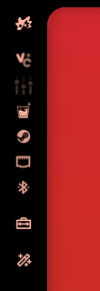

# Tinted icons

Draws app icons as solid glyphs in your theme's colour instead of their own
artwork, so the tray, dock, workspace pills and launcher all follow whatever
matugen generated from your wallpaper. The active workspace and the selected
launcher entry swap to the primary colour.

<p>

&nbsp;&nbsp;

</p>

## Install

```
https://github.com/drpezzer/ambxst-mods/tree/main/packages/tinted-icons
```

Paste that into **Settings → Mods**, or:

```bash
ambxst mods install https://github.com/drpezzer/ambxst-mods/tree/main/packages/tinted-icons
ambxst mods enable drpezzer.tinted-icons
ambxst reload
```

## What it changes

One patch, five files:

- `modules/components/Tinted.qml` — adds a `tintColor` property and draws the
  full tint at the icon's own brightness instead of forcing it to white.
- `modules/bar/systray/SysTrayItem.qml`, `modules/dock/DockAppButton.qml` —
  turn on the full tint.
- `modules/bar/workspaces/Workspaces.qml` — full tint, primary colour on the
  active workspace.
- `modules/widgets/launcher/LauncherView.qml` — full tint, primary colour on
  the selected entry, pane colour when expanded.

Works with Ambxst `>=1.3.0`. No new dependencies, no new config keys.
