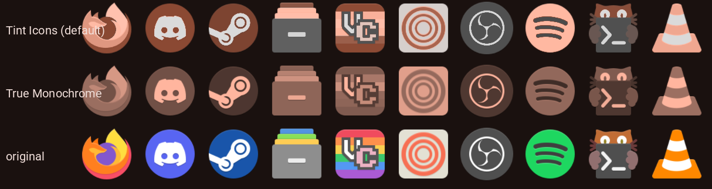

# Tinted icons

Adds two switches under *Settings → Theme → Tint Icons*, each usable on its
own. Stock *Tint Icons* is left exactly as Ambxst ships it.

- **True Matugen Icons** rethemes tinted app icons in the tray, dock, workspace
  pills and launcher through a lightness ramp built from your theme's primary
  family, so every icon lands in one hue with its own shading intact:
  gradients stay gradients, and the whole set follows whatever matugen
  generated from your wallpaper. The active workspace and the selected launcher
  entry swap to the primary colour.
- **True Monochrome** flattens icons to a single colour instead. It wins if
  both are on.

Neither needs *Tint Icons* on; both are off by default.



<p>

&nbsp;&nbsp;

</p>

## Install

```
https://github.com/drpezzer/ambxst-mods/tree/main/packages/tinted-icons
```

Paste that into **Settings → Mods**, or:

```bash
ambxst mods install https://github.com/drpezzer/ambxst-mods/tree/main/packages/tinted-icons
ambxst mods enable drpezzer.tinted-icons
ambxst reload
```

Then turn on *Settings → Theme → True Matugen Icons*.

## How the recolouring works

The ramp shader is a port of the colour mapping in
[Iconicul](https://codeberg.org/dvrkxed/iconicul) by dvrkxed (MIT), which
recolours whole icon themes on disk. Each pixel is converted to Lab, its
lightness is remapped onto the ramp's lightness range, the ramp anchors are
blended with a Gaussian window, and the result's chroma is scaled by how
saturated the source pixel was, so anti-aliased greys stay quiet. The ramp is
`background → primaryContainer → inversePrimary → primary → primaryFixed`.
Neutral pixels stay neutral in the dock, launcher and workspace pills; the
tray disables that because its icons are symbolic white glyphs.

Feeding a lightness mapping the whole 26-colour palette does not work:
matugen's accents share a lightness band, so they average out into beige.
Restricting the ramp to the primary family is what makes it read as a retheme.

## What it changes

- New: `modules/components/icon_ramp_tint.frag` / `.vert` and their compiled `.qsb` files.
- `modules/components/Tinted.qml` — the ramp palette and shader behind a `ramp`
  property, plus `monochrome` / `tintColor` / `neutralKeep`. The stock palette
  shader and the existing `fullTint` (used by the launcher logo) are untouched.
- `config/Config.qml`, `config/defaults/theme.js` — the `theme.trueMatugenIcons`
  and `theme.trueMonochromeTint` keys.
- `modules/widgets/dashboard/controls/ThemePanel.qml` — the two switches.
- `modules/globals/GlobalStates.qml` — the keys join the theme snapshot list.
- `SysTrayItem.qml`, `DockAppButton.qml`, `Workspaces.qml`, `LauncherView.qml`
  — pass the switches and the per-state colour into `Tinted`.

Works with Ambxst `>=1.3.0`.

## Changelog

- **2.2.0** — True Matugen Icons and True Monochrome no longer require
  Tint Icons to be on.

- **2.1.0** — stock *Tint Icons* is left alone; the ramp moves behind a
  *True Matugen Icons* switch next to *True Monochrome*.
- **2.0.1** — tray icons get the ramp's full hue: they are mostly symbolic
  white glyphs, which the neutral-preserving default left white.
- **2.0.0** — the tint became a primary-family lightness ramp (Iconicul's
  method); the flat single-colour mode moved behind a *True Monochrome* switch.
- **1.2.0** — monochrome only, no switch.
- **1.1.0** — restored the stock `fullTint`, which 1.0.0 had changed and which
  turned a dark launcher logo black. Thanks to Axenide for the report.
- **1.0.0** — first release.
